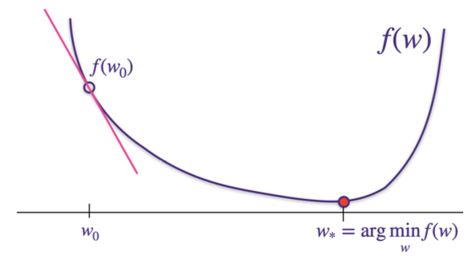
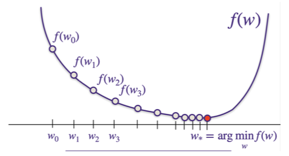

# Problem Set 1 Solutions: Train-Test Splitting, Generalized Least Squares Regression, MAP as Regularization

### 1. Biased Test Error
Is the test error unbiased for these programs? If not, how can we fix the code so it is?

#### 1.1. Program 1
```python
1 # Given dataset of 1000-by-50 feature
2 # matrix X, and 1000-by-1 labels vector
3
4 mu = np.mean(X, axis=0)
5 X = X - mu
6
7 idx = np.random.permutation(1000)
8 TRAIN = idx[0:900]
9 TEST = idx[900::]
10
11 ytrain = y[TRAIN]
12 Xtrain = X[TRAIN,:]
13
14 # solve for argmin_w ||Xtrain*w - ytrain||_2
15 w = np.linalg.solve(np.dot(Xtrain.T, Xtrain), np.dot(Xtrain.T, ytrain))
16
17 b = np.mean(ytrain)
18
19 ytest = y[TEST]
20 Xtest = X[TEST, :]
21
22 train_error = np.dot(np.dot(Xtrain, w)+b - ytrain,
23                      np.dot(Xtrain, w)+b - ytrain) / len(TRAIN)
24 test_error = np.dot(np.dot(Xtest, w)+b - ytest,
25                     np.dot(Xtest, w)+b - ytest) / len(TEST)
26
27 print('Train error = ', train_error)
28 print('Test error = ', test_error)
```

**Solution:**
The error is at the beginning of the program on lines 4 and 5. Notice how $`\mu`$ is a function of both the train and test data. By de-meaning the entire dataset before splitting, we are intertwining the train and test data. The correct procedure is:
*   Split into train and test
*   Compute the mean of the train data, $`\mu_{\text{train}}`$
*   De-mean both the train and test data with $`\mu_{\text{train}}`$

#### 1.2. Program 2
```python
1 # We are given: 1) dataset X with n=1000 samples and 50 features and 2) a vector y of length 1000 with labels.
2
3 # Consider the following code to train a model, using cross validation to perform hyperparameter tuning.
4 def fit(Xin, Yin, _lambda):
5     w = np.linalg.solve(np.dot(Xin.T, Xin) + _lambda * np.eye(Xin.shape[1]), np.dot(Xin.T, Yin))
6     b = np.mean(Yin) - np.dot(w, mu)
7     return w, b
8
9 def predict(w, b, Xin):
10     return np.dot(Xin, w) + b
11
12 idx = np.random.permutation(1000)
13 TRAIN = idx[0:800]
14 VAL = idx[800:900]
15 TEST = idx[900::]
16
17 ytrain = y[TRAIN]
18 Xtrain = X[TRAIN, :]
19 yval = y[VAL]
20 Xval = X[VAL, :]
21
22 # demean data
23 mu = np.mean(Xtrain, axis=0)
24 Xtrain = Xtrain - mu
25 Xval = Xval - mu
26
27 # use validation set to pick the best hyper-parameter to use
28 lambdas = [10 ** -5, 10 ** -4, 10 ** -3, 10 ** -2]
29 err = np.zeros(len(lambdas))
30
31 for idx, lambda_val in enumerate(lambdas):
32     w, b = fit(Xtrain, ytrain, lambda_val)
33     yval_hat = predict(w, b, Xval)
34     err[idx] = np.mean((yval_hat - yval) ** 2)
35
36 lambda_best = lambdas[np.argmin(err)]
37
38 Xtot = np.concatenate((Xtrain, Xval), axis=0)
39 ytot = np.concatenate((ytrain, yval), axis=0)
40
41 w, b = fit(Xtot, ytot, lambda_best)
42
43 ytest = y[TEST]
44 Xtest = X[TEST, :]
45
46 # demean data
47 Xtest = Xtest - mu
48
49 ytot_hat = predict(w, b, Xtot)
50 train_error = np.mean((ytot_hat - ytot) ** 2)
51 ytest_hat = predict(w, b, Xtest)
52 test_error = np.mean((ytest_hat - ytest) ** 2)
53
54 print('Train error = ', train_error)
55 print('Test error = ', test_error)
```

**Solution:**
We are adding the validation data back into training (creating $`X_{tot}`$), and then retraining the whole model on this data. However, optimal value of $`\lambda`$ **depends** on size of the training dataset, so by adding more data we are using incorrect value in final fit call. In general, models get better the more data you give them, but only add the validation set back in if you are confident the hyperparameter doesn't depend on the number of elements, and that you aren't allowing your model access to the test set.

### 2. Gradient Descent

Like we've seen in lecture, gradient descent is an important algorithm commonly used to train machine learning models, particularly useful for when there is no closed form solution for the minimum of a loss function. Here, we'll go through short introduction to the algorithm.

Consider some function $`f(w)`$, which has some $`w_*`$ for which $`w_* = \text{arg min}_w f(w)`$:


Let $`w_0`$ be some initial guess for the minimum of $`f(w)`$. Gradient descent will allow us to improve this solution.

#### (a) For some $`w`$ that is very close to $`w_0`$, give the Taylor series approximation for $`f(w)`$ starting at $`f(w_0)`$.

**Solution:**
For $`w`$ very close to $`w_0`$, we see that $`f(w) \approx f(w_0) + (w - w_0) \left(\frac{df(w)}{dw}\right)_{w=w_0}`$.



#### (b) Now, let us choose some $`\eta > 0`$ that is very small. With this very small $`\eta`$, let's assume that $`w_1 = w_0 - \eta \left(\frac{df(w)}{dw}\right)_{w=w_0}`$. Using your approximation from part (a), give an expression for $`f(w_1)`$.

**Solution:**
```math
w_1 = w_0 - \eta \left( \frac{df(w)}{dw} \Bigg|_{w=w_0} \right)
```

```math
f(w_1) \approx f(w_0) + (w_1 - w_0) \left( \frac{df(w)}{dw} \Bigg|_{w=w_0} \right)
```

```math
= f(w_0) + \left( w_0 - \eta \left( \frac{df(w)}{dw} \Bigg|_{w=w_0} \right) - w_0 \right) \left( \frac{df(w)}{dw} \Bigg|_{w=w_0} \right)
```

```math
= f(w_0) - \eta \left( \frac{df(w)}{dw} \Bigg|_{w=w_0} \right)^2
```

#### (c) Given your expression for $`f(w_1)`$ from part (b), explain why, if $`\eta`$ is small enough and if the function approximation is a good enough approximation, we are guaranteed to move in the "right" direction closer to the minimum $`w_*`$.

**Solution:**
Note that in part (b), the derivative is squared and will always be a nonnegative value. Therefore, $`f(w_1) < f(w_0)`$.

#### (d) Building from your answer in part (c), write a general form for the gradient descent algorithm.

**Solution:**
Gradient descent is written as:

For $`k = 0, 1, 2, 3, \dots`$,
```math
w_{k+1} = w_k - \eta \left( \frac{df(w)}{dw} \Bigg|_{w=w_k} \right)
```
Note that as $`k \to \infty`$, $`\left( \frac{df(w)}{dw} \Bigg|_{w=w_k} \right) \to 0`$.



### 3. Generalized Least Squares Regression

This generalizes linear regression and ridge regression. We want to find a model $`\mathbf{w} \in \mathbb{R}^d`$ that:
1. Minimizes error
2. Prevents large changes in solution from small training data changes
3. Allows for different weighting of $`\mathbf{w}`$ coordinates

We define $`\hat{\omega}_{\text{general}}`$ as:
```math
\hat{\omega}_{\text{general}} = \arg \min_{\omega} \sum_{i=1}^{n} (y_i - \mathbf{x}_i^\text{T}\omega)^2 + \lambda \sum_{i=1}^{d} D_{ii}\omega_i^2.
```

Note that $`\mathbf{D}`$ is a diagonal matrix with positive entries. If $`\mathbf{D}`$ is the identity matrix, we recover ridge regression. If $`\lambda = 0`$, we recover least squares regression. Different $`\mathbf{D}_{ii}`$ values control the magnitudes of $`\omega_i`$ differently.

#### 3.1. Closed form in the general case

Deduce the closed-form solution for $`\hat{\omega}_{\text{general}}`$. You should be comfortable with both "coordinate" and "matrix" forms of proofs.

**Solution:**
We give a proof using "matrix" notation:
The objective function $`f(w)`$ is:
```math
f(\omega) = ||\mathbf{X}\omega - \mathbf{y}||_2^2 + \lambda\omega^\text{T}\mathbf{D}\omega
```

```math
= (\mathbf{X}\omega - \mathbf{y})^\text{T}(\mathbf{X}\omega - \mathbf{y}) + \lambda\omega^\text{T}\mathbf{D}\omega
```

```math
= (\mathbf{X}\omega)^\text{T}\mathbf{X}\omega - (\mathbf{X}\omega)^\text{T}\mathbf{y} - \mathbf{y}^\text{T}\mathbf{X}\omega + \mathbf{y}^\text{T}\mathbf{y} + \lambda\omega^\text{T}\mathbf{D}\omega
```

```math
= \omega^\text{T}\mathbf{X}^\text{T}\mathbf{X}\omega - 2\omega^\text{T}\mathbf{X}^\text{T}\mathbf{y} + \mathbf{y}^\text{T}\mathbf{y} + \lambda\omega^\text{T}\mathbf{D}\omega
```

```math
= \omega^\text{T}(\mathbf{X}^\text{T}\mathbf{X} + \lambda\mathbf{D})\omega - 2\omega^\text{T}\mathbf{X}^\text{T}\mathbf{y} + \mathbf{y}^\text{T}\mathbf{y}
```

The gradient of $`f`$ is:
```math
\nabla f(\omega) = \nabla_\omega (\omega^\text{T}(\mathbf{X}^\text{T}\mathbf{X} + \lambda\mathbf{D})\omega - 2\omega^\text{T}\mathbf{X}^\text{T}\mathbf{y} + \mathbf{y}^\text{T}\mathbf{y})
```

```math
= \nabla_\omega (\omega^\text{T}(\mathbf{X}^\text{T}\mathbf{X} + \lambda\mathbf{D})\omega) - 2\nabla_\omega (\omega^\text{T}\mathbf{X}^\text{T}\mathbf{y}) + \nabla_\omega (\mathbf{y}^\text{T}\mathbf{y})
```

```math
= 2(\mathbf{X}^\text{T}\mathbf{X} + \lambda\mathbf{D})\omega - 2\mathbf{X}^\text{T}\mathbf{y}
```

Note that $`\mathbf{X}^\text{T}\mathbf{X} + \lambda\mathbf{D}`$ is a symmetric matrix, which explains the factor 2 in the gradient term. Setting the gradient $`\nabla f(\omega)`$ to zero yields:
```math
(\mathbf{X}^\text{T}\mathbf{X} + \lambda\mathbf{D})\hat{\omega}_{\text{general}} = \mathbf{X}^\text{T}\mathbf{y}
```

If $`\mathbf{X}^\text{T}\mathbf{X} + \lambda\mathbf{D}`$ is full rank, we can get a unique solution:
```math
\hat{\omega}_{\text{general}} = (\mathbf{X}^\text{T}\mathbf{X} + \lambda\mathbf{D})^{-1}\mathbf{X}^\text{T}\mathbf{y}
```

Since $`\mathbf{D}`$ is a diagonal matrix with strictly positive entries, any strictly positive $`\lambda`$ will make the matrix $`\mathbf{X}^\text{T}\mathbf{X} + \lambda\mathbf{D}`$ invertible.

We now give a solution in the "coordinate" form. The objective, when written in coordinate form, is $`f(\omega) = \sum_{i=1}^{n} (y_i - x_i^\top \omega)^2 + \lambda \sum_{i=1}^{d} D_{ii}\omega_i^2`$. As in the previous proof, we first simplify it as follows and then set it zero:

```math
\nabla_\omega \left[ \sum_{i=1}^{n} (y_i - x_i^\top \omega)^2 + \lambda \sum_{i=1}^{d} D_{ii}\omega_i^2 \right] = \nabla_\omega \sum_{i=1}^{n} (y_i - x_i^\top \omega)^2 + \nabla_\omega \lambda \sum_{i=1}^{d} D_{ii}\omega_i^2
```

```math
= \sum_{i=1}^{n} \nabla_\omega (y_i - x_i^\top \omega)^2 + 2\lambda D\omega
```

```math
= -\sum_{i=1}^{n} 2x_i (y_i - x_i^\top \omega) + 2\lambda D\omega
```

```math
= -\sum_{i=1}^{n} 2x_i y_i + \sum_{i=1}^{n} 2x_i x_i^\top \omega + 2\lambda D\omega
```

```math
= -2\sum_{i=1}^{n} x_i y_i + 2\left( \sum_{i=1}^{n} x_i x_i^\top + \lambda D \right) \omega
```

```math
= 0 \text{ (set it to be 0)}
```

```math
\hat{\omega}_{\text{general}} = \left( \sum_{i=1}^{n} x_i x_i^\top + \lambda D \right)^{-1} \left( \sum_{i=1}^{n} x_i y_i \right)
```

Note that, as expected, this exactly matches the answer we got from the previous approach (because $`x_i`$'s are all the rows of $`X`$, and therefore $`\sum_i x_i y_i = X^\top y`$, and $`\sum_i x_i x_i^\top = X^\top X`$).

#### 3.2. Special cases: linear regression and ridge regression

**(a) In the simple least squares case ($`\lambda = 0`$ above), what happens to the resulting $`\hat{\omega}`$ if we double all the values of $`y_i`$?**

**Solution:**
As can be seen from the formula $`\hat{\omega} = (X^T X)^{-1} X^T y`$, doubling $`y`$ doubles $`\omega`$ as well. This makes sense intuitively as well because if the observations are scaled up, the model should also be.

**(b) In the simple least squares case ($`\lambda = 0`$ above), what happens to the resulting $`\hat{\omega}`$ if we double the data matrix $`X \in \mathbb{R}^{n \times d}`$?**

**Solution:**
As can be seen from the formula $`\hat{\omega} = (X^T X)^{-1} X^T y`$, doubling $`X`$ halves $`\omega`$. This also makes sense intuitively because the error we are trying to minimize is $`||X\omega - y||_2^2`$, and if the $`X`$ has doubled, while $`y`$ has remained unchanged, then $`\omega`$ must compensate for it by reducing by a factor of 2.

**(c) Suppose $`D = I`$ (that is, it is the identity matrix). That is, this is the ridge regression setting. Explain why $`\lambda > 0`$ ensures a "well-conditioned" setting.**

**Solution:**
The solution is $`\hat{\omega} = (X^T X + \lambda I)^{-1} X^T y`$. We already saw in a previous part that $`X^T X`$ is always positive semidefinite, that is, its eigenvalues are at least zero. Adding $`\lambda I`$, where $`\lambda > 0`$, ensures that $`X^T X + \lambda I`$ is in fact positive definite. This helps us have a good condition number.

### 4. MAP as Regularization

Recall the regularization techniques:
(a) Ridge-Regression:
```math
\hat{w}_{\text{ridge}} = \text{arg min}_w \sum_{i=1}^n (y_i - x_i^T w)^2 + \lambda ||w||_2^2
```
(b) LASSO:
```math
\hat{w}_{\text{LASSO}} = \text{arg min}_w \sum_{i=1}^n (y_i - x_i^T w)^2 + \lambda ||w||_1
```

**Reminder:** don't ever regularize your bias term. This term doesn't add any complexity to the model (since it just shifts), so we'd like it to take on any value that best fits our training data.

These regularization types can be derived from a statistical perspective, assuming a prior belief about weights. Let $`w`$ be weights, $`Y`$ be labels, and $`X`$ be inputs.
$`p(X, Y|w)`$ represents the **likelihood function**.
A **prior distribution** over $`p(w)`$ specifies the belief about weights.
Using Bayes' Rule, the updated belief (posterior distribution) $`p(w|X, Y)`$ is given by:
```math
p(w|X,Y) = \frac{p(X,Y|w)p(w)}{p(X,Y)} = \frac{p(X,Y|w)p(w)}{\int_{w'} p(X,Y|w')p(w')dw'}
```
Here, $`p(w|X, Y)`$ is the **posterior distribution** and $`p(X, Y)`$ is the **evidence**.

**Maximum A Posteriori Estimation (MAP)** computes the weights that maximize the posterior distribution, $`p(w|X, Y)`$. It differs from MLE by incorporating the prior belief $`p(w)`$.
The MAP estimate is derived as:
```math
\hat{w}_{\text{MAP}} = \text{arg max}_w p(w|X, Y)
```
```math
= \text{arg max}_w \frac{p(X,Y|w)p(w)}{p(X, Y)}
```
```math
= \text{arg max}_w p(X, Y|w)p(w)
```
```math
= \text{arg max}_w \log p(X,Y|w) + \log p(w)
```
The denominator $`p(X, Y)`$ is disposed of because it doesn't depend on $`w`$.
This is contrasted with **MLE (Maximum Likelihood Estimation)**:
```math
\hat{w}_{\text{MLE}} = \text{arg max}_w p(X, Y|w)
```

Let us now study how we can obtain the Ridge and LASSO regression objectives from this perspective:

#### (a) Suppose the elements of $`w`$ are independently distributed according to a Laplacian distribution:
```math
p(w_i) = \frac{\lambda}{4\sigma^2} \exp\left(-\frac{|w_i|\lambda}{2\sigma^2}\right)
```
Show that under this prior on $`w`$, MAP estimation of the linear measurement model recovers the LASSO objective.

**Solution:**
We work in the argmax space, which allows us to drop and add constants or monotonically increasing functions as necessary.
```math
\underset{w}{\arg \max} p(w | Y, X) = \underset{w}{\arg \max} \log p(w | Y, X)
```
```math
= \underset{w}{\arg \max} \log p(X,Y | w) + \log p(w)
```
```math
\stackrel{*}{=} \underset{w}{\arg \max} \log \left\{ (2\pi)^{-\frac{n}{2}} (\sigma^2)^{-\frac{n}{2}} \exp\left(-\frac{1}{2}(Y - Xw)^\top (\sigma^2 I)^{-1}(Y - Xw)\right) \right. \\
\left. + \sum_{i=1}^{n} \log \frac{\lambda}{4\sigma^2} \exp\left(-\frac{|w_i|\lambda}{2\sigma^2}\right) \right\}
```
```math
= \underset{w}{\arg \max} -\frac{n}{2} \log(2\pi\sigma^2) - \frac{1}{2\sigma^2}(Y - Xw)^\top (Y - Xw) \\
+ n \log \frac{\lambda}{4\sigma^2} - \frac{\lambda}{2\sigma^2} \sum_{i=1}^{n} |w_i|
```
```math
\stackrel{**}{=} \underset{w}{\arg \max} -\frac{1}{2\sigma^2} \left[ (Y - Xw)^\top (Y - Xw) + \lambda \sum_{i=1}^{n} |w_i| \right]
```
```math
\stackrel{***}{=} \underset{w}{\arg \max} -\|Y - Xw\|_2^2 + \lambda\|w\|_1
```
```math
= \underset{w}{\arg \min}\|Y - Xw\|_2^2 + \lambda\|w\|_1,
```
where the first starred equality follows from applying the PDFs, and the second and third follow from dropping constant terms or multipliers. In other words, solving MAP with a Laplacian prior also solves the LASSO regression problem.

#### (b) Derive an expression for the prior on $`w`$ that corresponds to the ridge regression objective. What is the significance of this result?

**Solution:**
Our high-level approach to this problem is to expand the terms of the objective to a form that resembles the core of a PDF, then attach the additive/multiplicative constants necessary to recover the full form of the PDF. We do this first with the likelihood term (since we know its form), and then with the prior.
```math
\underset{w}{\arg \min}\|Y - Xw\|_2^2 + \lambda\|w\|_2^2 = \underset{w}{\arg \max}-(Y - Xw)^\top (Y - Xw) - \lambda w^\top w
```
```math
= \underset{w}{\arg \max}-\frac{1}{2\sigma^2}(Y - Xw)^\top (Y - Xw) - \frac{\lambda}{2\sigma^2} w^\top w
```
```math
= \underset{w}{\arg \max}-\frac{n}{2}\log(2\pi\sigma^2) - \frac{1}{2\sigma^2}(Y - Xw)^\top (Y - Xw) - \frac{\lambda}{2\sigma^2} w^\top w
```
```math
= \underset{w}{\arg \max} \log N(Y; Xw, \sigma^2 I) - \frac{\lambda}{2\sigma^2} w^\top w
```
```math
= \underset{w}{\arg \max} \log N(Y; Xw, \sigma^2 I) - \frac{n}{2} \log \left(2\pi \frac{\sigma^2}{\lambda}\right) - \frac{1}{2} w^\top \left(\frac{\sigma^2}{\lambda} I\right)^{-1} w
```
```math
= \underset{w}{\arg \max} \log N(Y; Xw, \sigma^2 I) + \log N\left(w; 0, \frac{\sigma^2}{\lambda} I\right).
```

In other words, our prior is that $`w \sim \mathcal{N} (0, \frac{\sigma^2}{\lambda}\mathbf{I})`$.
This means that when we apply $`\ell_2`$ regularization to our linear regression problem (i.e., ridge regression), we make the implicit assumption that our weight vector is drawn from a Gaussian prior. More generally, we can see that applying various forms of regularization correspond to different prior assumptions on $`w`$.

