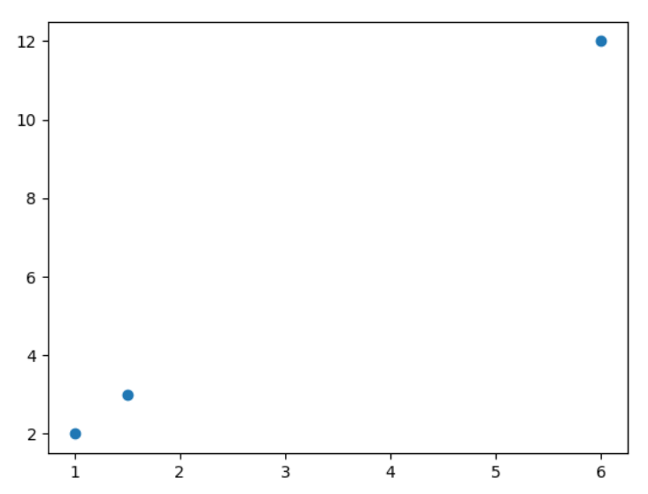
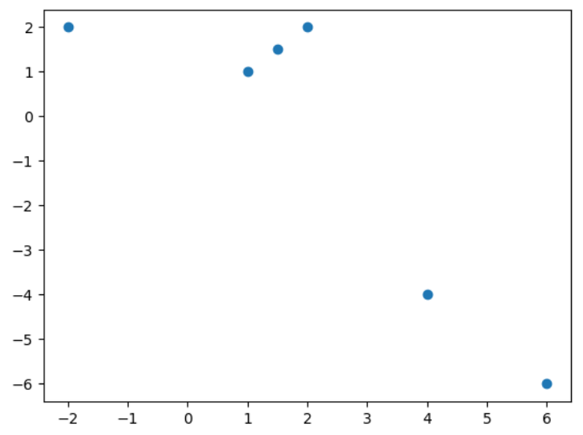

# Problem Set 6

## 1. Principal Component

Consider the following dataset, which is represented as three points in R². Note that in this problem we will not demean the dataset.

**Dataset Matrix:**
```
[ 1   2  ]
[ 1.5 3  ]
[ 6   12 ]
```



**Scatter Plot:**
A 2D scatter plot shows the three data points.
*   **X-axis:** Ranges from 1 to 6, with major ticks at 1, 2, 3, 4, 5, 6.
*   **Y-axis:** Ranges from 2 to 12, with major ticks at 2, 4, 6, 8, 10, 12.
*   **Plotted Points:** Three blue circular markers are visible:
    *   One at coordinates (1, 2)
    *   One at coordinates (1.5, 3)
    *   One at coordinates (6, 12)
These points appear to lie perfectly on a straight line passing through the origin.

### (a)

What is the first principal component vector, $`v_1`$?

### (b)

What is the second principal component, $`v_2`$?

### (c)

If we use only the first principal component to compress the dataset, what will the representation of each point be?

### (d)

Will this representation be lossy, or perfectly preserve the dataset?

**Answer the same questions for the following, slightly larger dataset:**

**Dataset (a 6x2 matrix):**
```
[ 1    1  ]
[ 1.5  1.5]
[ -2   2  ]
[ 4   -4  ]
[ 6   -6  ]
[ 2    2  ]
```


### (a)

What is the first principal component vector, $`v_1`$?

### (b)

What is the second principal component, $`v_2`$?

### (c)

If we use only the first principal component to compress the dataset, what will the representation of each point be?

### (d)

Will this representation be lossy, or perfectly preserve the data?

## 2. Using the Eigenbasis

A useful fact about symmetric $`n \times n`$ matrices is that they have a set of eigenvectors $`u_1, ..., u_n`$ that satisfy three properties:
*   $`||u_i||_2 = 1`$ (each eigenvector has a unit norm).
*   $`u_i^T u_j = 0, \forall i \neq j`$ (eigenvectors are orthogonal to each other).
*   $`u_1, ..., u_n`$ form a basis of $`\mathbb{R}^n`$.

This fact is useful because it simplifies proofs by allowing one to think about vectors in terms of their "eigenbasis" components instead of standard basis components. As a trivial example, we'll show how to calculate $`Ax`$ for a vector $`x`$ without performing direct matrix multiplication.

### (a)

Consider the matrix $`A = \begin{bmatrix} 4 & -1 \\ -1 & 4 \end{bmatrix}`$. Verify that $`u_1 = \begin{bmatrix} 1/\sqrt{2} \\ 1/\sqrt{2} \end{bmatrix}`$ and $`u_2 = \begin{bmatrix} -1/\sqrt{2} \\ 1/\sqrt{2} \end{bmatrix}`$ are eigenvectors and meet the definitions. Find the eigenvalues associated with $`u_1`$ and $`u_2`$.

### (b)

Since $`\{u_1, u_2\}`$ are a basis, we can write any vector as a linear combination of them. Write $`x = \begin{bmatrix} -1/\sqrt{2} \\ 3/\sqrt{2} \end{bmatrix}`$ in this basis.

### (c)

Based on the eigenvectors and eigenvalues your found in part a, diagonalize A, i.e, find matrix U and D such that $`UDU^T = A`$ where all entries of D are 0 except for the ones on the diagonal.

### (d)

Use the decomposition and the eigenvalues you calculated in the previous parts to calculate Ax without doing matrix-vector multiplication.

## 3. Singular Value Decomposition - Proofs

Recall that if we have a symmetric, square matrix $`A \in \mathbb{R}^{n \times n}`$, we can eigen-decompose it in the form of $`A = USU^T`$, where the columns of $`U`$ are eigenvectors of $`A`$ with lengths of 1, and the diagonal of $`S`$ is the list of eigenvalues corresponding to those eigenvectors.

Now, for a more general case, where $`A`$ is a data matrix with the dimension of $`\mathbb{R}^{n \times d}`$, there is still a way to decompose it: $`A = USV^T`$, where $`U \in \mathbb{R}^{n \times n}`$, $`S`$ is a rectangular diagonal matrix and $`S \in \mathbb{R}^{n \times d}`$, and $`V \in \mathbb{R}^{d \times d}`$. It is called Singular Value Decomposition (SVD).

### (a)

Let A have SVD $`USV^T`$. Show $`AA^T`$ has the columns of $`U`$ as eigenvectors with associated eigenvalues $`S^2`$.

### (b)

Let A have SVD $`USV^T`$. Show $`A^T A`$ has the columns of $`V`$ as eigenvectors with associated eigenvalues $`S^2`$.

### (c)

Show that for a matrix $`A`$, given $`AA^T = US^2U^T`$ and $`A^T A = VS^2V^T`$, then $`A = USV^T`$. In other words, show that for any vector $`x \in \mathbb{R}^d`$, $`Ax = USV^T x`$.

## 4. Convolutional Neural Networks

### (a)

Discuss the advantages of a convolutional layer compared to a fully connected one.

### (b)

Discuss the advantages of maxpooling in CNN.

## 5. Shapes in Convolutional Neural Networks

Understanding data shapes is crucial when designing convolutional neural networks. This problem set aims to provide experience and intuition regarding why CNNs require fewer parameters compared to fully connected layers.

**Shape of a convolutional layer / maxpooling output:**
For a $`n \times n`$ input, $`f \times f`$ filter, padding $`p`$, and stride $`s`$:
```math
o = \frac{n - f + 2p}{s} + 1
```

### (a)

Pytorch `Conv2d` will represent 2D convolution and `MaxPool2d` will represent 2D max pooling. Given an initial input tensor shape of `(N, 3, 64, 64)` (a batch of `N` 64x64 RGB images), determine the new shape of the tensor after each operation. Note that activations are omitted as they don't change data shape.

**1. Operation:** `Conv2D(in_channels=3, out_channels=16, kernel_size=3, stride=1, padding=1)`

**2. Operation:** `MaxPool2d(kernel_size=2, stride=2, padding=0)`

**3. Operation:** `Conv2D(in_channels=16, out_channels=32, kernel_size=3, stride=1, padding=0)`

**4. Operation:** `MaxPool2d(kernel_size=2, stride=2, padding=1)`

**5. Operation:** `Conv2D(in_channels=32, out_channels=8, kernel_size=1, stride=1, padding=0)`

### (b)

For each convolutional and fully connected layer, compute the number of parameters. For convolutional layers, also compute the number of parameters for a hypothetical fully connected layer mapping from the flattened input channels to the flattened output channels. Parameter calculations can be left as products and additions.

**Layer 1: `Conv2D(in_channels=3, out_channels=16, kernel_size=3, stride=1, padding=1)`**

**Layer 2: `MaxPool2d(kernel_size=2, stride=2, padding=0)`**

**Layer 3: `Conv2D(in_channels=16, out_channels=32, kernel_size=3, stride=1, padding=0)`**

**Layer 4: `MaxPool2d(kernel_size=2, stride=2, padding=1)`**

**Layer 5: `Conv2D(in_channels=32, out_channels=8, kernel_size=1, stride=1, padding=0)`**

**Layer 6: `Conv2D(in_channels=8, out_channels=4, kernel_size=5, stride=1, padding=0)`**

**Layer 7: `Flatten`**

**Layer 8: `Linear(in_features=576, out_features=10)`**

