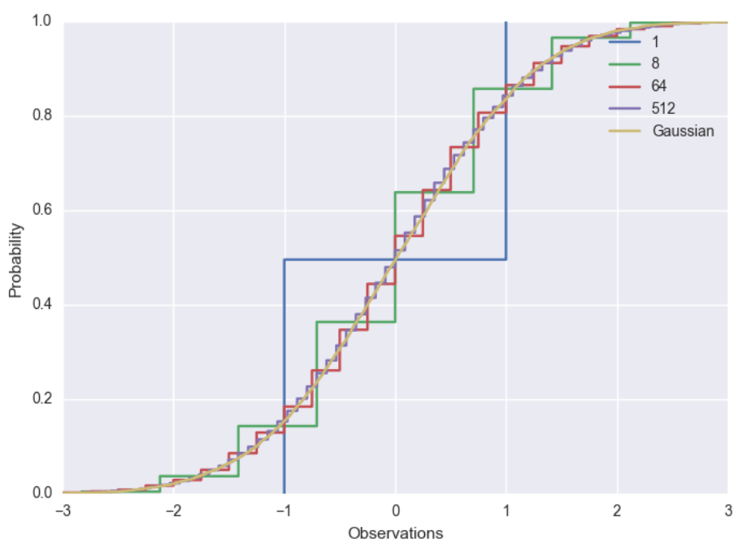

# Problem Set 1

## Probability and Statistics

### Problem A1

After your yearly checkup, the doctor has bad news and good news. The bad news is that you tested positive for a serious disease, and that the test is 99% accurate (i.e., the probability of testing positive given that you have the disease is 0.99, as is the probability of testing negative given that you don't have the disease). The good news is that this is a rare disease, striking only one in 10,000 people.

**Question:** What are the chances that you actually have the disease?

### Problem A2

For two random variables $X$ and $Y$, we define the covariance as:
$$Cov(X, Y) = E[(X - E[X])(Y - E[Y])]$$

(You may assume $X$ and $Y$ take on discrete values if it simplifies your work.)

**Part a:** If $E[Y | X = x] = x$ show that $Cov(X, Y) = E[(X - E[X])^2]$.

**Part b:** If $X, Y$ are independent show that $Cov(X, Y) = 0$.

### Problem A3

Let $X$ and $Y$ be independent random variables with PDFs $f$ and $g$, respectively. Let $h$ be the PDF of the random variable $Z = X + Y$.

**Part a:** Show that $h(z) = \int_{-\infty}^{\infty} f(x)g(z-x) dx$.

*(If you are more comfortable with discrete probabilities, you can instead derive an analogous expression for the discrete case, and then you should give a one sentence explanation as to why your expression is analogous to the continuous case.)*

**Part b:** If $X$ and $Y$ are both independent and uniformly distributed on $[0, 1]$ (i.e. $f(x) = g(x) = 1$ for $x \in [0, 1]$ and 0 otherwise) what is $h$, the PDF of $Z = X + Y$?

### Problem A4

Let $X_1, X_2, \ldots, X_n \sim N(\mu, \sigma^2)$ be i.i.d. random variables. Compute the following:

**Part a:** $a \in \mathbb{R}, b \in \mathbb{R}$ such that $aX_1 + b \sim N(0, 1)$.

**Part b:** $E[X_1 + 2X_2]$, $Var[X_1 + 2X_2]$.

**Part c:** Setting $\hat{\mu}_n = \frac{1}{n} \sum_{i=1}^{n} X_i$, the mean and variance of $\sqrt{n}(\hat{\mu}_n - \mu)$.

## Linear Algebra and Vector Calculus

### Problem A5

Let $A$ and $B$ be matrices. For each matrix $A$ and $B$:

Matrix $A$:
```
[1 2 1]
[1 0 3]
[1 1 2]
```

Matrix $B$:
```
[1 2 3]
[1 0 1]
[1 1 2]
```

**Part a:** What is its rank?

**Part b:** What is a (minimal size) basis for its column span?

### Problem A6

Let $A$ be a matrix, $b$ be a vector, and $c$ be a vector.

Matrix $A$:
```
[0 2 4]
[2 4 2]
[3 3 1]
```

Vector $b$: $[-2 \quad -2 \quad -4]^T$

Vector $c$: $[1 \quad 1 \quad 1]^T$

**Part a:** What is $Ac$?

**Part b:** What is the solution to the linear system $Ax = b$?

### Problem A7

For possibly non-symmetric $A, B \in \mathbb{R}^{n \times n}$ and $c \in \mathbb{R}$, let $f(x, y) = x^T A x + y^T B x + c$. Define $\nabla_z f(x, y) = [\frac{\partial f}{\partial z_1}(x, y) \quad \frac{\partial f}{\partial z_2}(x, y) \quad \ldots \quad \frac{\partial f}{\partial z_n}(x, y)]^T \in \mathbb{R}^n$.

**Part a:** Explicitly write out the function $f(x, y)$ in terms of the components $A_{i,j}$ and $B_{i,j}$ using appropriate summations over the indices.

**Part b:** What is $\nabla_x f(x, y)$ in terms of the summations over indices and vector notation?

**Part c:** What is $\nabla_y f(x, y)$ in terms of the summations over indices and vector notation?

### Problem A8

Show the following:

**Part a:** Let $g: \mathbb{R} \rightarrow \mathbb{R}$ and $v, w \in \mathbb{R}^n$ such that $g(v_i) = w_i$ for $i \in [n]$. Find an expression for $g$ such that $diag(v)^{-1} = diag(w)$.

**Problem b:** Let $A \in \mathbb{R}^{n \times n}$ be orthonormal and $x \in \mathbb{R}^n$. An orthonormal matrix is a square matrix whose columns and rows are orthonormal vectors, such that $AA^T = A^TA = I$ where $I$ is the identity matrix. Show that $||Ax||_2 = ||x||_2$.

**Problem c:** Let $B \in \mathbb{R}^{n \times n}$ be invertible and symmetric. A symmetric matrix is a square matrix satisfying $B = B^T$. Show that $B^{-1}$ is also symmetric.

**Problem d:** Let $C \in \mathbb{R}^{n \times n}$ be positive semi-definite (PSD). A positive semi-definite matrix is a symmetric matrix satisfying $x^TCx \geq 0$ for any vector $x \in \mathbb{R}^n$. Show that its eigenvalues are non-negative.

## Programming

These problems are available in a .zip file, with some starter code. All coding questions will have starter code. Unzip the HW0-A.zip file and read the instructions in the README file to get started.

### Problem A9

For $\nabla f(x, y)$ as solved for in Problem 7:

**Part a:** Using native Python, implement vanilla_solution using your vanilla_matmul and vanilla_transpose functions.

**Part b:** Now implement numpy_version using NumPy functions.

**Part c:** Report the difference in wall-clock time for parts a-b, and discuss reasons for the observed difference.

### Problem A10

Two random variables $X$ and $Y$ have equal distributions if their CDFs, $F_X$ and $F_Y$, respectively, are equal, i.e. for all $x$, $|F_X(x) - F_Y(x)| = 0$. The central limit theorem says that the sum of $k$ independent, zero-mean, variance $1/k$ random variables converges to a (standard) Normal distribution as $k$ tends to infinity.

We will study this phenomenon empirically (you will use the Python packages NumPy and Matplotlib). Each of the following subproblems includes a description of how the plots were generated; these have been coded for you. The code is available in the zip file.

In this problem, you will add to our implementation to explore matplotlib library, and how the solution depends on $n$ and $k$.

**Part a:** For $i = 1,\ldots, n$ let $Z_i \sim N(0,1)$. Let $x \mapsto F(x)$ denote the true CDF from which each $Z_i$ is drawn (i.e., Gaussian). Define $\hat{F}_n(x) = \frac{1}{n} \sum_{i=1}^{n} 1\{Z_i \leq x\}$ for $x \in \mathbb{R}$ and we will choose $n$ large enough such that, for all $x \in \mathbb{R}$,

$$\sqrt{E[(\hat{F}_n(x) - F(x))^2]} \leq 0.0025$$

Plot $x \mapsto \hat{F}_n(x)$ for $x$ ranging from -3 to 3.

**Part b:** For $i = 1,\ldots, k$ let $B_i$ be independent random variables taking values -1 or 1 with equal probability. Let $Y(k) = \frac{1}{\sqrt{k}} \sum_{i=1}^{k} B_i$. Note that $\frac{1}{\sqrt{k}} B_i$ is zero-mean and has variance $1/k$. Generate $n$ independent copies of $Y(k)$ for $k \in \{1, 8, 64, 512\}$ and plot their empirical CDFs on the same graph. Use the same $n$ as in part a. Label your axes and use seaborn for better-looking plots.

Your plot should look something like the following:
