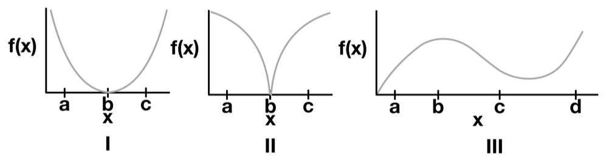

# Problem Set 3

## Conceptual Questions

**A1.** The answers to these questions should be answerable without referring to external materials. Briefly justify your answers with a few words.

a. Suppose that your estimated model for predicting house prices has a large positive weight on the feature number of bathrooms. If we remove this feature and refit the model, will the new model have a strictly higher error than before? Why?

b. Compared to L2 norm penalty, explain why a L1 norm penalty is more likely to result in sparsity (a larger number of 0s) in the weight vector.

c. In at most one sentence each, state one possible upside and one possible downside of using the following regularizer: $\left(\sum_{i}\left|w_{i}\right|^{0.5}\right)$.

d. True or False: If the step-size for gradient descent is too large, it may not converge.

e. In your own words, describe why stochastic gradient descent (SGD) works, even though only a small portion of the data is considered at each update.

f. In at most one sentence each, state one possible advantage of SGD over GD (gradient descent), and one possible disadvantage of SGD relative to GD.

## Convexity and Norms

**A2.** A norm $\| \cdot \|$ over $\mathbb{R}^n$ is defined by the properties: (i) non-negativity: $\|x\| \ge 0$ for all $x \in \mathbb{R}^n$ with equality if and only if $x = 0$, (ii) absolute scalability: $\|ax\| = |a| \|x\|$ for all $a \in \mathbb{R}$ and $x \in \mathbb{R}^n$, (iii) triangle inequality: $\|x + y\| \le \|x\| + \|y\|$ for all $x, y \in \mathbb{R}^n$.

a. Show that $f(x) = \left(\sum_{i=1}^{n}\left|x_{i}\right|\right)$ is a norm. (Hint: for (iii), begin by showing that $|a+b| \le |a|+|b|$ for all $a, b \in \mathbb{R}$.)

b. Show that $g(x) = \left(\sum_{i=1}^{n}\left|x_{i}\right|^{1/2}\right)^2$ is not a norm. (Hint: it suffices to find two points in $n = 2$ dimensions such that the triangle inequality does not hold.)

**Context:** norms are often used in regularization to encourage specific behaviors of solutions. If we define $\|x\|_{p} := \left(\sum_{i=1}^{n}\left|x_{i}\right|^{p}\right)^{1/p}$ then one can show that $\|x\|_{p}$ is a norm for all $p \ge 1$. The important cases of $p = 2$ and $p = 1$ correspond to the penalty for ridge regression and the lasso, respectively.

## Convexity of Sets

**A3.** A set $A \subset \mathbb{R}^n$ is convex if $\lambda x + (1 - \lambda)y \in A$ for all $x, y \in A$ and $\lambda \in [0,1]$.

For each of the grey-shaded sets below (I-III), state whether each one is convex, or state why it is not convex using any of the points a, b, c, d in your answer.


## Convexity of Functions

**A4.** We say a function $f: \mathbb{R}^d \to \mathbb{R}$ is convex on a set $A$ if $f(\lambda x + (1 - \lambda)y) \le \lambda f(x) + (1 - \lambda)f(y)$ for all $x, y \in A$ and $\lambda \in [0,1]$.

For each of the functions shown below (I-III), state whether each is convex on the specified interval, or state why not with a counterexample using any of the points $a, b, c, d$ in your answer.



a. Function in panel I on $[a, c]$

b. Function in panel II on $[a, c]$

c. Function in panel III on $[a, d]$

d. Function in panel III on $[c, d]$

## Lasso on a Real Dataset

**A5.** Given $\lambda > 0$ and data $(x_i, y_i)_{i=1}^n$, the Lasso is the problem of solving

$$\arg \min_{w \in \mathbb{R}^d, b \in \mathbb{R}} \sum_{i=1}^n (x_i^T w + b - y_i)^2 + \lambda \sum_{j=1}^d |w_j|$$

where $\lambda$ is a regularization parameter. For the programming part of this homework, you will implement the iterative shrinkage thresholding algorithm shown in Algorithm 1 to solve the Lasso problem in `ISTA.py`. This is a variant of the subgradient descent method and a more detailed discussion can be found in these `slides`. You may use common computing packages (such as `numpy` or `scipy`), but do not use an existing Lasso solver (e.g., of `scikit-learn`).

You may use common computing packages (such as `numpy` or `scipy`), but do not use an existing Lasso solver (e.g., of `scikit-learn`).

Before you get started, the following hints may be useful:

**Algorithm 1: Iterative Shrinkage Thresholding Algorithm for Lasso**

* **Input:** Step size $\eta$
* The algorithm proceeds in a `while` loop that continues `not converged`.
* Inside the `while` loop:
  * The bias term $b$ is updated: $b' \leftarrow b - 2\eta \sum_{i=1}^n (x_i^T w + b - y_i)$
  * A `for` loop iterates `for k ∈ {1,2,...d} do`:
    * The weight $w_k$ is updated: $w_k' \leftarrow w_k - 2\eta \sum_{i=1}^n x_{i,k} (x_i^T w + b - y_i)$
    * A conditional shrinkage step is applied to $w_k'$:
      * If $w_k' < -2\eta\lambda$, then $w_k' \leftarrow w_k + 2\eta\lambda$
      * If $w_k' \in [-2\eta\lambda, 2\eta\lambda]$, then $w_k' \leftarrow 0$
      * If $w_k' > 2\eta\lambda$, then $w_k' \leftarrow w_k - 2\eta\lambda$
  * After the `for` loop, the updated values are assigned: $b \leftarrow b'$, $w \leftarrow w'$

**Implementation Advice and Notes:**

* Wherever possible, use matrix libraries for matrix operations (not for loops).
* There are opportunities to considerably speed up parts of the algorithm by precomputing quantities like $a_k$ before the for loop; you are permitted to add these improvements (and it may save you some time).
* As a sanity check, ensure the objective value is nonincreasing with each step.
* It is up to you to decide on a suitable stopping condition. A common criteria is to stop when no element of $w$ changes by more than some small $\delta$ during an iteration. If you need your algorithm to run faster, an easy place to start is to loosen this condition.
* You will need to solve the Lasso on the same dataset for many values of $\lambda$. This is called a regularization path. One way to do this efficiently is to start at a large $\lambda$, and then for each consecutive solution, initialize the algorithm with the previous solution, decreasing $\lambda$ by a constant ratio (e.g., by a factor of 2).
* The smallest value of $\lambda$ for which the solution $\hat{w}$ is entirely zero is given by:
  $$\lambda_{max} = \max_{k=1,...,d} \left| 2 \sum_{i=1}^n x_{i,k} \left( y_i - \frac{1}{n} \sum_{j=1}^n y_j \right) \right| \quad (1)$$
* This is helpful for choosing the first $\lambda$ in a regularization path.

## Synthetic Data and Lasso Regularization Path

**A6.** We will first try your solver with some synthetic data. A benefit of the Lasso is that if we believe many features are irrelevant for predicting $y$, the Lasso can be used to enforce a sparse solution, effectively differentiating between the relevant and irrelevant features.

Suppose that $x \in \mathbb{R}^d$, $y \in \mathbb{R}$, $k < d$, and data are generated independently according to the model $y_i = w^T x_i + \epsilon_i$ where:
$$w_j = \begin{cases} j/k & \text{if } j \in \{1,...,k\} \\ 0 & \text{otherwise} \end{cases} \quad (2)$$

And $\epsilon_i \sim N(0, \sigma^2)$ is noise (note that in the model above $b = 0$). We can see from Equation (2) that since $k < d$ and $w_j = 0$ for $j > k$, the features $k+1$ through $d$ are irrelevant for predicting $y$.

Generate a dataset using this model with $n = 500$, $d = 1000$, $k = 100$, and $\sigma = 1$. You should generate the dataset such that each $\epsilon_i \sim N(0, 1)$, and $y_i$ is generated as specified above. You are free to choose a distribution from which the $x$'s are drawn, but make sure standardize the $x$'s before running your experiments.

a. With your synthetic data, solve multiple Lasso problems on a regularization path, starting at $\lambda_{max}$ where no features are selected (see Equation (1)) and decreasing $\lambda$ by a constant ratio (e.g., 2) until nearly all the features are chosen. In plot 1, plot the number of non-zeros as a function of $\lambda$ on the x-axis (Tip: use `plt.xscale('log')`).

b. For each value of $\lambda$ tried, record values for false discovery rate (FDR) (number of incorrect nonzeros in $\hat{w}$/total number of nonzeros in $\hat{w}$) and true positive rate (TPR) (number of correct nonzeros in $\hat{w}/k$). Note: for each $j$, $\hat{w}_j$ is an incorrect nonzero if and only if $\hat{w}_j \neq 0$ while $w_j = 0$. In plot 2, plot these values with the x-axis as FDR, and the y-axis as TPR.
Note that in an ideal situation we would have an (FDR,TPR) pair in the upper left corner. We can always trivially achieve (0,0) and $(\frac{d-k}{d}, 1)$.

c. Comment on the effect of $\lambda$ in these two plots in 1-2 sentences.

## Crime Data Analysis

**A7.** We'll now put the Lasso to work on some real data in `crime_data_lasso.py`. We have read in the data for you with the following:

```python
df_train, df_test = load_dataset("crime")
```

This stores the data as Pandas DataFrame objects. DataFrames are similar to Numpy arrays but more flexible; unlike arrays, DataFrames store row and column indices along with the values of the data. Each column of a DataFrame can also store data of a different type (here, all data are floats). Here are a few commands that will get you working with Pandas for this assignment:

```python
df.head()                     # Print the first few lines of DataFrame df.
df.index                      # Get the row indices for df.
df.columns                    # Get the column indices.
df['foo']                     # Return the column named 'foo'.
df.drop('foo', axis = 1)      # Return all columns except 'foo'.
df.values                     # Return the values as a Numpy array.
df['foo'].values              # Grab column foo and convert to Numpy array.
df.iloc[:3,:3]                # Use numerical indices (like Numpy) to get 3 rows and cols.
```

The data consist of local crime statistics for 1,994 US communities. The response $y$ is the rate of violent crimes reported per capita in a community. The name of the response variable is ViolentCrimesPerPop, and it is held in the first column of df_train and df_test. There are 95 features. These features include many variables. Some features are the consequence of complex political processes, such as the size of the police force and other systemic and historical factors. Others are demographic characteristics of the community, including self-reported statistics about race, age, education, and employment drawn from Census reports.

The goals of this problem are threefold: (i) to encourage you to think about how data collection processes affect the resulting model trained from that data; (ii) to encourage you to think deeply about models you might train and how they might be misused; and (iii) to see how Lasso encourages sparsity of linear models in settings where $d$ is large relative to $n$. We emphasize that training a model on this dataset can suggest a degree of correlation between a community's demographics and the rate at which a community experiences and reports violent crime. We strongly encourage students to consider why these correlations may or may not hold more generally, whether correlations might result from a common cause, and what issues can result in misinterpreting what a model can explain.

The dataset is split into a training and test set with 1,595 and 399 entries, respectively¹. We will use this training set to fit a model to predict the crime rate in new communities and evaluate model performance on the test set. As there are a considerable number of input variables and fairly few training observations, overfitting is a serious issue. In order to avoid this, use the Lasso algorithm implemented in the previous problem.

a. Read the documentation for the original version of this dataset: `http://archive.ics.uci.edu/ml/datasets/communities+and+crime`. Report 3 features included in this dataset for which historical policy choices in the US would lead to variability in these features. As an example, the *number of police* in a community is often the consequence of decisions made by governing bodies, elections, and amount of tax revenue available to decision makers.

b. Before you train a model, describe 3 features in the dataset which might, if found to have nonzero weight in model, be interpreted as *reasons* for higher levels of violent crime, but which might actually be a *result* rather than (or in addition to being) the cause of this violence.

Now, we will run the Lasso solver. Begin with $\lambda = \lambda_{max}$ defined in Equation (1). Initialize all weights to 0. Then, reduce $\lambda$ by a factor of 2 and run again, but this time initialize $\hat{w}$ from your $\lambda = \lambda_{max}$ solution as your initial weights, as described above. Continue the process of reducing $\lambda$ by a factor of 2 until $\lambda < 0.01$. For all plots use a log-scale for the $\lambda$ dimension (Tip: use `plt.xscale('log')`).

c. Plot the number of nonzero weights of each solution as a function of $\lambda$.

d. Plot the regularization paths (in one plot) for the coefficients for input variables `agePct12t29`, `pctWSocSec`, `pctUrban`, `agePct65up`, and `householdsize`.

e. On one plot, plot the squared error on the training and test data as a function of $\lambda$.

f. Sometimes a larger value of $\lambda$ performs nearly as well as a smaller value, but a larger value will select fewer variables and perhaps be more interpretable. Retrain and inspect the weights $\hat{w}$ for $\lambda = 30$ and for *all* input variables. Which feature had the largest (most positive) Lasso coefficient? What about the most negative? Discuss briefly.

g. Suppose there was a large negative weight on `agePct65up` and upon seeing this result, a politician suggests policies that encourage people over the age of 65 to move to high crime areas in an effort to reduce crime. What is the (statistical) flaw in this line of reasoning? (Hint: fire trucks are often seen around burning buildings, do fire trucks cause fire?)

## Logistic Regression

### Binary Logistic Regression

**A8.** Here we consider the MNIST dataset, but for binary classification. Specifically, the task is to determine whether a digit is a 2 or 7. Here, let $Y = 1$ for all the "7" digits in the dataset, and use $Y = -1$ for "2".
We will use regularized logistic regression. Given a binary classification dataset $\{(x_i, y_i)\}_{i=1}^n$ for $x_i \in \mathbb{R}^d$ and $y_i \in \{-1, 1\}$ we showed in class that the regularized negative log likelihood objective function can be written as

$$J(w, b) = \frac{1}{n} \sum_{i=1}^n \log(1 + \exp(-y_i(b + x_i^T w))) + \lambda||w||^2$$

Note that the offset term $b$ is not regularized. For all experiments, use $\lambda = 10^{-1}$. Let $\mu_i(w, b) = \frac{1}{1+\exp(-y_i(b+x_i^T w))}$.

a. Derive the gradients $\nabla_wJ(w,b)$, $\nabla_bJ(w, b)$ and give your answers in terms of $\mu_i(w, b)$ (your answers should not contain exponentials).

b. Implement gradient descent with an initial iterate of all zeros. Try several values of step sizes to find one that appears to make convergence on the training set as fast as possible. Run until you feel you are near to convergence.

(i) For both the training set and the test, plot $J(w, b)$ as a function of the iteration number (and show both curves on the same plot).

(ii) For both the training set and the test, classify the points according to the rule $\operatorname{sign}(b + x^T w)$ and plot the misclassification error as a function of the iteration number (and show both curves on the same plot).

Reminder: Make sure you are only using the test set for evaluation (not for training).

c. Repeat (b) using stochastic gradient descent with a batch size of 1. Note, the expected gradient with respect to the random selection should be equal to the gradient found in part (a). Show both plots described in (b) when using batch size 1. Take careful note of how to scale the learning rate.

d. Repeat (b) using stochastic gradient descent with batch size of 100. That is, instead of approximating the gradient with a single example, use 100. Note, the expected gradient with respect to the random selection should be equal to the gradient found in part (a).
