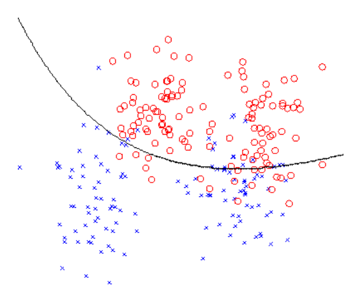

# Problem Set 2 Solutions

## Problem 1: Least Squares

### Problem 1(a) [2 points]

**Problem:** Let $\hat{\theta} = \arg \min_{\theta} J(\theta)$ be the minimizer of the original least squares objective (using the original design matrix $X$). Using the orthonormality assumption, show that $J(\hat{\theta}) = (XX^T \bar{y} - \bar{y})^T (XX^T \bar{y} - \bar{y})$. I.e., show that this is the value of $\min_{\theta} J(\theta)$ (the value of the objective at the minimum).

**Answer:** We know from lecture that the least squares minimizer is $\hat{\theta} = (X^T X)^{-1} X^T \bar{y}$ but because of the orthonormality assumption, this simplifies to $\hat{\theta} = X^T \bar{y}$. Substituting this expression into the normal equation for $J(\theta)$ gives the final expression $J(\hat{\theta}) = (XX^T \bar{y} - \bar{y})^T (XX^T \bar{y} - \bar{y})$.

### Problem 1(b) [5 points]

**Problem:** Now let $\hat{\theta}_{\text{new}}$ be the minimizer for $\tilde{J}(\theta_{\text{new}}) = (\tilde{X}\theta_{\text{new}} - \vec{y})^T(\tilde{X}\theta_{\text{new}} - \vec{y})$. Find the new minimized objective $\tilde{J}(\hat{\theta}_{\text{new}})$ and write this expression in the form: $\tilde{J}(\hat{\theta}_{\text{new}}) = J(\hat{\theta}) + f(X, \vec{v}, \vec{y})$ where $J(\hat{\theta})$ is as derived in part (a) and $f$ is some function of $X, \vec{v}$, and $\vec{y}$.

**Answer:** Just like we had in part (a), the minimizer for the new objective is $\hat{\theta}_{\text{new}} = \tilde{X}^T\vec{y}$. Now we solve for the new minimized objective:

$\tilde{J}(\hat{\theta}_{\text{new}}) = (\tilde{X}\hat{\theta}_{\text{new}} - \vec{y})^T(\tilde{X}\hat{\theta}_{\text{new}} - \vec{y})$
$= (\tilde{X}\tilde{X}^T\vec{y} - \vec{y})^T(\tilde{X}\tilde{X}^T\vec{y} - \vec{y})$
$= ((XX^T + \vec{v}\vec{v}^T)\vec{y} - \vec{y})^T((XX^T + \vec{v}\vec{v}^T)\vec{y} - \vec{y})$
$= ((XX^T\vec{y} - \vec{y}) + \vec{v}\vec{v}^T\vec{y})^T((XX^T\vec{y} - \vec{y}) + \vec{v}\vec{v}^T\vec{y})$
$= (XX^T\vec{y} - \vec{y})^T(XX^T\vec{y} - \vec{y}) + 2(XX^T\vec{y} - \vec{y})^T(\vec{v}\vec{v}^T\vec{y}) + (\vec{v}\vec{v}^T\vec{y})^T(\vec{v}\vec{v}^T\vec{y})$
$= J(\hat{\theta}) + 2(XX^T\vec{y} - \vec{y})^T(\vec{v}\vec{v}^T\vec{y}) + (\vec{v}\vec{v}^T\vec{y})^T(\vec{v}\vec{v}^T\vec{y})$

### Problem 1(c) [6 points]

**Problem:** Prove that the optimal objective value does not increase upon adding a feature to the design matrix. That is, show $\tilde{J}(\hat{\theta}_{\text{new}}) \le J(\hat{\theta})$.

**Answer:** Using the final result of part (b), we can continue simplifying the expression for $J(\hat{\theta}_{\text{new}})$ as follows:
\[
\begin{aligned}
\tilde{J}(\hat{\theta}_{\text{new}}) &= J(\hat{\theta}) + 2(XX^T\tilde{y} - \tilde{y})^T(vv^T\tilde{y}) + (vv^T\tilde{y})^T(vv^T\tilde{y}) \\
&= J(\hat{\theta}) + 2(XX^T\tilde{y})^T(vv^T\tilde{y}) - 2\tilde{y}^T(vv^T\tilde{y}) + (vv^T\tilde{y})^T(vv^T\tilde{y}) \\
&= J(\hat{\theta}) + 2(\tilde{y}^T XX^T vv^T\tilde{y}) - 2(\tilde{y}^T vv^T\tilde{y}) + (\tilde{y}^T vv^T vv^T\tilde{y}) \\
&= J(\hat{\theta}) - \tilde{y}^T vv^T\tilde{y} \\
&= J(\hat{\theta}) - (v^T\tilde{y})^2 \\
&\le J(\hat{\theta})
\end{aligned}
\]
From the third to last equality to the second to last equality, we use the two facts that $X^T v = 0$ and $v^T v = 1$.

The proof is complete.

Note for this problem we also accepted solutions where parts (b) and (c) overlapped.

### Problem 1(d) [3 points]

**Problem:** Does the above result show that if we keep increasing the number of features, we can always get a model that generalizes better than a model with fewer features? Explain why or why not.

**Answer:** The result shows that we can either maintain or decrease the minimized square error objective by adding more features. However, remember that the error objective is computed only on the training samples and not the true data distribution. As a result, reducing training error does not guarantee a reduction in error on the true distribution. In fact, after a certain point adding features will likely lead to overfitting, increasing our generalization error. Therefore, adding features does not actually always result in a model that generalizes better.

## Problem 2: Decision Boundaries for Generative Models

### Problem 2(a) [7 points]

**Problem:** Consider the multinomial event model of Naive Bayes. Our goal in this problem is to show that this is a linear classifier.

For a given text document $x$, let $c_1, \dots, c_V$ indicate the number of times each word (out of $V$ words) appears in the document. Thus, $c_i \in \{0, 1, 2, \dots\}$ counts the occurrences of word $i$. Recall that the Naive Bayes model uses parameters $\phi_y = p(y = 1)$, $\phi_{i|y=1} = p(\text{word i appears in a specific document position } | y = 1)$ and $\phi_{i|y=0} = p(\text{word i appears in a specific document position } | y = 0)$.

We say a classifier is linear if it assigns a label $y = 1$ using a decision rule of the form
$$ \sum_{i=1}^V w_i c_i + b \ge 0 $$
I.e., the classifier predicts "$y = 1$" if $\sum_{i=1}^V w_i c_i + b \ge 0$, and predicts "$y = 0$" otherwise.

Show that Naive Bayes is a linear classifier, and clearly state the values of $w_i$ and $b$ in terms of the Naive Bayes parameters. (Don't worry about whether the decision rule uses "$\ge$" or "$>$.") Hint: consider using log-probabilities.

**Answer:**
The decision boundary for Naive Bayes can be stated as
$$ P(y = 1|c; \Phi) > P(y = 0|c; \Phi) $$
$$ \log p(y = 1|c; \Phi) > \log p(y = 0|c; \Phi) $$
$$ \log p(y = 1|c; \Phi) - \log p(y = 0|c; \Phi) > 0 $$
$$ \log \frac{p(y = 1|c; \Phi)}{p(y = 0|c; \Phi)} > 0 $$
$$ \log \frac{p(y = 1) \prod_{i=1}^V p(E_i|y = 1)^{c_i}}{p(y = 0) \prod_{i=1}^V p(E_i|y = 0)^{c_i}} > 0 $$
$$ \log \frac{p(y = 1)}{p(y = 0)} + \sum_{i=1}^V \log p(E_i|y = 1)^{c_i} - \log p(E_i|y = 0)^{c_i} > 0 $$
$$ \log \frac{p(y = 1)}{p(y = 0)} + \sum_{i=1}^V c_i \log \frac{p(E_i|y = 1)}{p(E_i|y = 0)} > 0 $$
Using the given parameters:
$$ \log \frac{\phi_y}{1 - \phi_y} + \sum_{i=1}^V c_i \log \frac{\phi_{i|y=1}}{\phi_{i|y=0}} > 0 $$
Thus, Naive Bayes is a linear classifier with
$$ w_i = \log \frac{\phi_{i|y=1}}{\phi_{i|y=0}} $$
$$ b = \log \frac{\phi_y}{1 - \phi_y} $$

### Problem 2(b) [7 points]

**Problem:** In Problem Set 1, you showed that Gaussian Discriminant Analysis (GDA) is a linear classifier. In this problem, we will show that a modified version of GDA has a quadratic decision boundary.

Recall that GDA models $p(x|y)$ using a multivariate normal distribution, where $(x|y = 0) \sim \mathcal{N}(\mu_0, \Sigma)$ and $(x|y = 1) \sim \mathcal{N}(\mu_1, \Sigma)$, where we used the same $\Sigma$ for both Gaussians.

For this question, we will instead use two covariance matrices $\Sigma_0, \Sigma_1$ for the two labels. So, $(x|y = 0) \sim \mathcal{N}(\mu_0, \Sigma_0)$ and $(x|y = 1) \sim \mathcal{N}(\mu_1, \Sigma_1)$.

The model distributions can now be written as:
$p(y) = \phi^y (1 - \phi)^{1-y}$
$p(x|y = 0) = \frac{1}{(2\pi)^{n/2} |\Sigma_0|^{1/2}} \exp\left(-\frac{1}{2}(x - \mu_0)^T \Sigma_0^{-1} (x - \mu_0)\right)$
$p(x|y = 1) = \frac{1}{(2\pi)^{n/2} |\Sigma_1|^{1/2}} \exp\left(-\frac{1}{2}(x - \mu_1)^T \Sigma_1^{-1} (x - \mu_1)\right)$

Let's follow a binary decision rule, where we predict $y = 1$ if $p(y = 1|x) \ge p(y = 0|x)$, and $y = 0$ otherwise. Show that if $\Sigma_0 \ne \Sigma_1$, then the separating boundary is quadratic in $x$.
That is, simplify the decision rule "$p(y = 1|x) \ge p(y = 0|x)$" to the form "$x^T Ax + B^T x + C \ge 0$" (supposing that $x \in \mathbb{R}^{n+1}$), for some $A \in \mathbb{R}^{(n+1)\times(n+1)}$, $B \in \mathbb{R}^{n+1}$, $C \in \mathbb{R}$ and $A \ne 0$. Please clearly state your values for $A, B$ and $C$.

