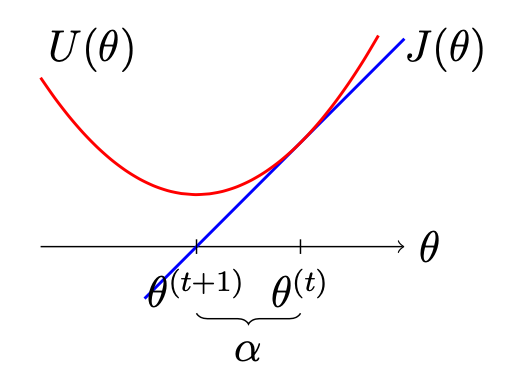

# Problem Set 4 Solutions

## Problem 1: Short Answers [24 points]

### (a) [5 points] Optimization Update Rule

**Problem:** Given a cost function $J(\theta)$ that we seek to minimize and $\alpha \in \mathbb{R} > 0$, consider the following update rule:

$$\theta^{(t+1)} = \arg\min_{\theta} \left\{ J(\theta^{(t)}) + \nabla_{\theta^{(t)}} J(\theta^{(t)})^T (\theta - \theta^{(t)}) + \frac{1}{2\alpha} \|\theta - \theta^{(t)}\|^2 \right\}$$

**(i) [3 points]** Show that this yields the same $\theta^{(t+1)}$ as the gradient descent update with step size $\alpha$.

**Answer:**

Denote $U(\theta) = J(\theta^{(t)}) + \nabla_{\theta^{(t)}} J(\theta^{(t)})^T (\theta - \theta^{(t)}) + \frac{1}{2\alpha} \|\theta - \theta^{(t)}\|^2$.

To find the minimum over $\theta$, we compute the gradient of $U(\theta)$ w.r.t. $\theta$ and set it to 0:

$$\nabla_{\theta} U(\theta) = 0$$
$$\nabla_{\theta^{(t)}} J(\theta^{(t)}) + \frac{1}{2\alpha} (-2\theta^{(t)} + 2\theta) = 0$$
$$\alpha\nabla_{\theta^{(t)}} J(\theta^{(t)}) - \theta^{(t)} + \theta = 0$$
$$\Rightarrow \theta = \theta^{(t)} - \alpha\nabla_{\theta^{(t)}} J(\theta^{(t)})$$

which is the gradient descent update, as desired.

To confirm this is a minimum, we compute the Hessian $\nabla_{\theta}^2 U = \frac{1}{\alpha}I$ which is positive definite as expected.

**(ii) [2 points]** Provide a sketch (i.e. draw a picture) of the above update for the simplified case where $\theta \in \mathbb{R}$, $J(\theta) = \theta$, and $\theta^{(t)} = 1$. Make sure to clearly label $\theta^{(t)}$, $\theta^{(t+1)}$ and $\alpha$.

**Answer:**

We provide an example sketch for $\alpha = 1$. Note that $\alpha = \theta^{(t)} - \theta^{(t+1)}$ since $\nabla J(\theta) = 1$.

### (b) [4 points] Loss Functions in Binary Classification

**Problem:** In the binary classification setting where $y \in \{-1, +1\}$, the margin is defined as $z = y\theta^T x$, where $\theta$ and $x$ lie in $\mathbb{R}^n$.

Three loss functions are given:
i. zero-one loss: $\varphi_{zo}(z) = \mathbf{1}\{z \le 0\}$
ii. exponential loss: $\varphi_{\exp}(z) = e^{-z}$
iii. hinge loss: $\varphi_{\text{hinge}}(z) = \max\{1 - z, 0\}$

Suppose that the margin $z < 0$ for the current parameters $\theta$.

1. Give the expression for $\frac{\partial}{\partial \theta_k}\varphi(y\theta^T x)$ for each of the given loss functions.
2. Identify which loss would fail to minimize with gradient descent, no matter the step size chosen.

**Answer:**

The expressions for the partial derivatives are:

i. $\frac{\partial}{\partial \theta_k}\varphi_{zo}(y\theta^T x) = 0$
ii. $\frac{\partial}{\partial \theta_k}\varphi_{\exp}(y\theta^T x) = -yx_k e^{-z}$
iii. $\frac{\partial}{\partial \theta_k}\varphi_{\text{hinge}}(y\theta^T x) = -yx_k$

Since the zero-one loss is 0 for margin $z < 0$, no matter the step size our parameter values would remain unchanged, and hence we fail to minimize the loss with gradient descent.

### (c) [5 points] Spam Classification: Naive Bayes vs Boosting

**Problem:** Consider performing spam classification where each e-mail is represented as a vector $\mathbf{x}$ of the same size as the number of words in the vocabulary $|V|$, where $x_i$ is 1 if the e-mail contains word $i$ and 0 otherwise. We saw in class that Naive Bayes with Laplace smoothing is one simple method for performing classification in this setting. For this question, to simplify we set $p(y = 1) = p(y = -1) = 0.5$.

Consider classifying $\mathbf{x}$ by instead using the boosting algorithm with $2|V|$ decision stumps as the weak learners. In this setting, which of the two methods, Naive Bayes or boosting with decision stumps, would you expect to yield lower bias? Explain your reasoning.

**Answer:**

First, note that since $\mathbf{x}$ is a vector of only 0s and 1s, the decision stump thresholds can all be set to any value strictly between 0 and 1 and have the same effect. One possible output of the boosting algorithm would simply be of the form $\text{sign}(\theta^T[\mathbf{x}; \mathbf{x}])$ for $\theta \in \mathbb{R}^{2|V|}$ (where we replace the 0s in $\mathbf{x}$ with -1s).

For each possible word, Naive Bayes learns two parameters, $p(x_j|y = 1)$ and $p(x_j|y = -1)$, and hence also has $2|V|$ parameters (this is crucial for comparing the two classifiers!). The decision rule in log space is also linear: output $\text{sign}(\sum_j \log p(x_j|y = 1) - \sum_j \log p(x_j|y = -1))$. However, Naive Bayes makes the generative modeling assumption that $p(\mathbf{x}|y)$ is modeled by independent word counts. On the other hand, as a discriminative model boosting allows for more possible values of $\theta$, and hence has a larger hypothesis space and should achieve lower bias.

### (d) [4 points] Linear SVM Decision Boundary Changes

**Problem:** Consider a linear SVM classifier trained for binary classification using the hinge loss $L(\theta^T x, y) = \max\{0, 1 - y\theta^T x\}$. For each of the following scenarios, does the optimal decision boundary necessarily remain the same? Explain your reasoning and sketch a picture if helpful. Assume that after performing the action in each scenario, there is still at least one training example in both the positive and negative classes.

i. Remove all examples $(x^{(i)}, y^{(i)})$ with margin $> 1$.
ii. Remove all examples $(x^{(i)}, y^{(i)})$ with margin $< 1$.
iii. Add an $\ell_2$-regularization term $\frac{\lambda}{2}\theta^T\theta = \frac{\lambda}{2} \|\theta\|^2$ to the training loss.
iv. Scale all $x^{(i)}$ by a constant factor $\alpha$.

**Answer:**

i. **Yes;** the loss is not affected by examples with margin $> 1$.

ii. **No;** the loss is affected by these examples and hence we may have different optimal $\theta$.

iii. **No;** the regularization term directly encourages $\theta$ with smaller $\ell_2$-norm, hence changing the decision boundary.

iv. **No;** consider 1-D counter-example with $\alpha = 2$, $x^{(1)}$ at the origin, and $x^{(2)}$ at 1; the decision boundary moves from 0.5 to 1.

### (e) [6 points] Bias-Variance Tradeoff Scenarios

**Problem:** We consider a binary classification task where we have $m$ training examples and our hypothesis $h_\theta(x)$ is parameterized by $\theta$. For each of the following scenarios, select whether we should expect bias and variance to increase or decrease. Explain your reasoning.

**Scenario i:** Project the values of $\theta$ to lie between $-1$ and $1$ after each training update, that is $\theta_j = \min\{1, \max\{-1, \theta_j\}\}$.

**Scenario ii:** Smooth the estimates of our hypotheses by outputting
$h(x) = (1/3) \sum_{x^{(i)} \in N_3(x)} h_\theta(x^{(i)})$,
where $N_3(x)$ are the 3 points in the training set closest to $x$.

**Scenario iii:** Remove one of the feature dimensions of $x$.

**Answer:**

i. Bias should increase and variance should decrease since we're reducing the hypothesis space of the model.

ii. Bias should increase and variance should decrease since smoothing encourages more similar outputs for different examples. For example, consider the extreme case where we smooth by outputting the mean over all $m$ examples; we then have very high bias and 0 variance since we make the same prediction for every input.

iii. Bias should increase and variance should decrease since for the same reason as in (i); the hypothesis space is now a strict subset of the previous space.

## Problem 2: Linear Regression - First Order Convergence for Least Squares

**Problem:** Consider the least squares problem, where we pick $\theta$ to minimize the objective $J(\theta) = \frac{1}{2}(X^T\theta-y)^T(X^T\theta-y)$. The solution to this problem is given by the normal equation, where $\theta = (XX^T)^{-1}Xy$. In Problem Set 1, we showed that a single Newton step will converge to the correct solution. Now we will examine how gradient descent performs on the same problem.

### (a) [4 points] Gradient Descent Update

**Problem:** Find the gradient of $J$ with respect to $\theta$, and write the gradient descent update step for $\theta^{(t+1)}$, given $\theta^{(t)}$ and step size $\alpha$.

**Answer:**

$\nabla_\theta J = XX^T\theta - Xy$; $\theta^{(t+1)} = \theta^{(t)} - \alpha(XX^T\theta^{(t)} - Xy)$

### (b) [8 points] Convergence to Optimal Solution

**Problem:** Show that as $t \to \infty$, $\theta^{(t+1)} \to (XX^T)^{-1}Xy$, for gradient descent with step size $\alpha$ and initial condition $\theta^{(0)} = 0$. You may use the fact that $(\alpha A)^{-1} = \sum_{i=0}^{\infty} (I - \alpha A)^i$ for small $\alpha > 0$, and assume that the choice of $\alpha$ is small enough.

**Answer:**

From (a), we have the gradient descent update:

$$\theta^{(t+1)} = \theta^{(t)} - \alpha XX^T \theta^{(t)} + \alpha Xy$$

$$= (I - \alpha XX^T) \theta^{(t)} + \alpha Xy$$

$$\theta^{(t+1)} = (I - \alpha XX^T)^{t+1} \theta^{(0)} + \sum_{i=1}^{t+1} (I - \alpha XX^T)^{t+1-i} \alpha Xy$$

Given $\theta^{(0)} = 0$ and adjusting the summation index:

$$\theta^{(t+1)} = 0 + \alpha \sum_{i=0}^{t} (I - \alpha XX^T)^i Xy$$

As $t \to \infty$, $\sum_{i=0}^{t} (I - \alpha XX^T)^i = (\alpha XX^T)^{-1}$. Using this, we now have:

$$\theta^{(t+1)} = \alpha \alpha^{-1} (XX^T)^{-1} Xy$$

$$= (XX^T)^{-1} Xy$$

## Problem 3: Generative Models - Gaussian Discriminant Analysis [12 points]

**Problem:** Consider the 1-dimensional Gaussian discriminant analysis model where $x \in \mathbb{R}$ and we assume

$$p(y) = \phi^{1\{y=1\}} (1-\phi)^{1\{y=-1\}}$$

$$p(x|y = -1) = \frac{1}{\sqrt{2\pi\sigma^2}} \exp\left(-\frac{1}{2\sigma^2}(x-\mu_{-1})^2\right)$$

$$p(x|y = 1) = \frac{1}{\sqrt{2\pi\sigma^2}} \exp\left(-\frac{1}{2\sigma^2}(x-\mu_1)^2\right)$$

In this problem we will assume that $\sigma$ is a fixed quantity that we have been given and is therefore not a parameter of the model.

Recall from Problem Set 1 that we can express $p(y|x; \phi, \mu_{-1}, \mu_1)$ in the form

$$p(y|x; \theta) = \frac{1}{1 + \exp(-y(\theta_1 x + \theta_0))}$$

where for the model described above we have,

$$\theta_0 = \frac{1}{2\sigma^2}(\mu_{-1}^2 - \mu_1^2) - \log \frac{1-\phi}{\phi}$$

$$\theta_1 = \frac{1}{\sigma^2}(\mu_1 - \mu_{-1})$$

### (a) [2 points] Joint Log-Likelihood

**Problem:** Write the joint log-likelihood $\ell(\phi, \mu_{-1}, \mu_1) = \log p(x, y; \phi, \mu_{-1}, \mu_1)$ for a single example $(x, y)$.

**Answer:**

$$p(x, y; \phi, \mu_{-1}, \mu_1) = p(y; \phi)p(x|y; \mu_{-1}, \mu_1)$$

$$\log p(x, y; \phi, \mu_{-1}, \mu_1) = \log p(y|\phi) + \log p(x|y; \mu_{-1}, \mu_1)$$

$$= \log(1 - \phi)^{1\{y=-1\}} \log(\phi)^{1\{y=1\}} + \log \frac{1}{\sqrt{2\pi\sigma^2}} - \frac{1}{2\sigma^2}(x - \mu_y)^2$$

### (b) [7 points] Concavity of Log-Likelihood

**Problem:** Show that the log-likelihood of all training examples $\{(x^{(i)},y^{(i)})\}_{i=1}^m$ is concave (and hence any maximum we find must be the global maximum) by first computing $\frac{\partial^2 \ell}{\partial \phi^2}$, $\frac{\partial^2 \ell}{\partial \mu_{-1}^2}$, and $\frac{\partial^2 \ell}{\partial \mu_1^2}$ for a single example $(x, y)$. Then make an argument that the total log-likelihood is concave. Hint: Recall a function is concave if its Hessian is negative semidefinite. A one-dimensional function $f$ is concave if $f''(x) \le 0$ for all $x$.

**Answer:**

First we show that the log-likelihood is concave for a single $(x, y)$.

$$\frac{\partial \ell}{\partial \phi} = -1\{y = -1\}\frac{1}{1 - \phi} + 1\{y = 1\}\frac{1}{\phi}$$

$$\frac{\partial^2 \ell}{\partial \phi^2} = \begin{cases} -\phi^{-2} & y = 1 \\ -(1 - \phi)^{-2} & y = -1 \end{cases}$$

which is negative for both cases.

$$\frac{\partial \ell}{\partial \mu_y} = \frac{1}{\sigma^2}(x - \mu_y)$$

$$\frac{\partial^2 \ell}{\partial \mu_y^2} = -\frac{1}{\sigma^2}$$

and negative as well.

Since $\phi$ and $\mu_y$ are in separate terms, the Hessian $H$ must be diagonal and negative along the diagonal. Hence $H$ is negative semidefinite, and $\ell$ is concave in both $\phi$ and $\mu_y$. Due to linearity of differentiation, the sum of concave functions is concave, and thus log-likelihood over all training $m$ examples must be concave as well.

### (c) [3 points] Decision Boundary

**Problem:** Derive an expression for the decision boundary for classifying $x$ as either $y = -1$ or $1$.

**Answer:**

We want $p(y = -1|x;\theta) = p(y = 1|x;\theta) = 0.5$ and hence set $\theta_1x + \theta_0 = 0$ where $\theta_1$ and $\theta_0$ are given in the problem statement.

Solving, we find:

$$x = \frac{2\sigma^2 \log \frac{1-\phi}{\phi} + (\mu_1^2 - \mu_{-1}^2)}{2(\mu_1 - \mu_{-1})}$$

Note that setting $p(x|y = -1) = p(x|y = 1)$ does not work, since this does not take into account $p(y)$.

## Problem 4: Generalized Linear Models - Gaussian Distribution

**Problem:** Assume we are given $x_1, x_2, \dots, x_n$ drawn i.i.d. $\sim N(\mu, \sigma^2)$, that is,

$$p(x_i; \mu, \sigma) = \frac{1}{\sqrt{2\pi\sigma^2}} \exp\left( -\frac{1}{2\sigma^2}(x_i - \mu)^2 \right)$$

Define $s^2 = \sum_{i=1}^n (x_i - \bar{x})^2$ where $\bar{x} = \frac{\sum_{i=1}^n x_i}{n}$.

### (a) [3 points] Unbiased Estimator

**Problem:** Prove $g(x) = \frac{s^2}{n-1}$ is an unbiased estimator of $\sigma^2$, that is

$$E[g(x)] = \sigma^2$$

Hint: $E[x_i] = \mu$, $Var(x_i) = \sigma^2$, $Cov(x_i, x_j) = 0$.

**Answer:**

$$E[g(x)] = \frac{1}{n-1} E\left[ \sum_{i=1}^n x_i^2 - n\bar{x}^2 \right]$$

$$= \frac{1}{n-1} \left( n(\sigma^2 + \mu^2) - \frac{1}{n}(n(\sigma^2 + \mu^2) + \mu^2n(n - 1)) \right)$$

$$= \frac{1}{n-1} \left( (n - 1)(\sigma^2 + \mu^2) - (n - 1)\mu^2 \right)$$

$$= \sigma^2$$

### (b) [5 points] Maximum Likelihood Estimation

**Problem:** Find the maximum-likelihood estimate of $\mu$ and $\sigma^2$. Hint: You should be able to express your final expression for $\sigma^2$ in terms of $s^2$.

**Answer:**

$$L = \prod_{i=1}^{n} p(x_i; \mu, \sigma^2)$$

$$= \prod_{i=1}^{n} \frac{1}{\sqrt{2\pi\sigma^2}} \exp\left(-\frac{(x_i - \mu)^2}{2\sigma^2}\right)$$

$$l = -\frac{1}{2} \sum_{i=1}^{n} \left(\log 2\pi\sigma^2 + \frac{(x_i - \mu)^2}{\sigma^2}\right)$$

$$\nabla_{\sigma^2}l = -\frac{1}{2} \sum_{i=1}^{n} \left(\frac{1}{\sigma^2} - \frac{(x_i - \mu)^2}{\sigma^4}\right)$$

$$\nabla_{\mu}l = \frac{1}{2} \sum_{i=1}^{n} \left(\frac{2(x_i - \mu)}{\sigma^2}\right)$$

Setting $\nabla_{\sigma^2}l = 0$ and $\nabla_{\mu}l = 0$, we have:

$$\mu = \frac{\sum_{i=1}^{n} x_i}{n}$$

$$\sigma^2 = \frac{1}{n} \sum_{i=1}^{n} (x_i - \mu)^2 = \frac{s^2}{n}$$

### (c) [6 points] Exponential Family Form

**Problem:** Show that the general form of the Gaussian distribution is a member of the exponential family by finding $b(x)$, $\eta$, $T(x)$, and $a(\eta)$. Hint: Since both $\mu$ and $\sigma^2$ are parameters, $\eta$ and $T(x)$ will now be two dimensional vectors. Denote $\eta = [\eta_1, \eta_2]^T$ and try to express $a(\eta)$ in terms of $\eta_1$ and $\eta_2$.

**Answer:**

$$b(x) = \frac{1}{\sqrt{2\pi}}$$

$$\eta = \left[\frac{\mu}{\sigma^2}, -\frac{1}{2\sigma^2}\right]^T$$

$$T(x) = [x, x^2]^T$$

$$a(\eta) = \frac{\mu^2}{2\sigma^2} + \log \sigma = -\frac{\eta_1^2}{4\eta_2} - \frac{1}{2}\log(-2\eta_2)$$

### (d) [4 points] Verification of Exponential Family Properties

**Problem:** Verify that $\nabla_\eta a(\eta) = E[T(x); \eta]$ for the Gaussian distribution. Hint: You can prove this either by using the general form of exponential families, or by computing $\nabla_\eta a(\eta)$ directly from part (c).

**Answer:**

In general for an exponential family,

$$\int h(x) \exp (\eta^T T(x) - a(\eta)) dx = 1$$

Thus we have:

$$a(\eta) = \log \int h(x) \exp (\eta^T T(x)) dx$$

$$\nabla_\eta a(\eta) = \frac{\int h(x) \exp (\eta^T T(x)) T(x)dx}{\int h(x) \exp (\eta^T T(x)) dx}$$

$$= \frac{\int h(x) \exp (\eta^T T(x) - a(\eta)) T(x)dx}{\int h(x) \exp (\eta^T T(x) - a(\eta)) dx}$$

$$= E[T(x); \eta]$$

We consider the two components of $\eta$ separately for the case of the Gaussian distribution:

$$\nabla_{\eta_1} a(\eta) = \nabla_{\eta_1} \left( -\frac{\eta_1^2}{4\eta_2} - \frac{1}{2} \log(-2\eta_2) \right)$$

$$= -\frac{2\eta_1}{4\eta_2}$$

$$= \mu$$

$$= E[x]$$

$$\nabla_{\eta_2} a(\eta) = \nabla_{\eta_2} \left( -\frac{\eta_1^2}{4\eta_2} - \frac{1}{2} \log(-2\eta_2) \right)$$

$$= \frac{\eta_1^2}{4\eta_2^2} - \frac{1}{2\eta_2}$$

$$= \mu^2 + \sigma^2$$

$$= E[x^2]$$

### (e) [4 points] Positive Semidefiniteness of Hessian

**Problem:** Show that $\nabla_\eta^2 a(\eta)$ is positive semidefinite. Hint: You can compute $\nabla_\eta^2 a(\eta)$ using the results from part (c) and (d). Or instead you may use the following fact: In general for exponential families,

$$\nabla_\eta^2 a(\eta) = E [T(x)T(x)^T] - E[T(x)]E[T(x)]^T$$

**Answer:**

Applying the above formula, we have:

$$\nabla_\eta^2 a(\eta) = \begin{bmatrix} \sigma^2 & 2\mu\sigma^2 \\ 2\mu\sigma^2 & 4\mu^2\sigma^2 + 2\sigma^4 \end{bmatrix}$$

We can then confirm the Hessian (covariance of $T(x)$) is positive semidefinite:

$$z^T[\nabla_\eta^2 a(\eta)]z = \sigma^2 z_1^2 + 4\mu\sigma^2 z_1 z_2 + 4\mu^2 \sigma^2 z_2^2 + 2\sigma^4 z_2^2$$

$$= (\sigma z_1 + 2\mu\sigma z_2)^2 + 2\sigma^4 z_2^2$$

$$\ge 0.$$

## Problem 5: Shift Invariant Kernels

**Problem:** A kernel $K$ on $\mathbb{R}^n$ is said to be shift invariant if:
$\forall \delta \in \mathbb{R}^n, \forall x, z \in \mathbb{R}^n, K(x, z) = K(x + \delta, z + \delta)$

### (a) [4 points] Examples of Shift Invariant and Non-Shift Invariant Kernels

**Problem:** Give an example of a shift invariant and a non-shift invariant kernels seen in lectures (no need to prove they are kernels). For the rest of this problem, we will simplify a bit and consider the case where $n = 1$.

**Answer:**

$K(x, z) = \alpha \exp -\frac{\|x-z\|^2}{2\tau^2}$ with $\alpha \geq 0$; $K(x, z) = \beta(x^Tz + 1)^d$ with $\beta \geq 0$.

### (b) [6 points] Kernel Property Proof

**Problem:** Let $p(\omega)$ be a probability density over $\mathbb{R}$. Let $\phi : \mathbb{R}^n \times \mathbb{R} \to \mathbb{R}^d$. Define $F : \mathbb{R}^n \times \mathbb{R}^n \to \mathbb{R}$ as:

$$F(x, z) = \int_{-\infty}^{\infty} \phi(x, \omega)^T \phi(z, \omega) p(\omega) d\omega$$

Show that $F$ is a kernel for all $x, z \in \mathbb{R}^n$.

**Answer:**

We show that $F$ is a kernel by showing that the Gram matrix $K_{ij} = F(x^{(i)}, x^{(j)})$ is positive semidefinite.

$$\sum_{1 \le i,j \le m} z_i z_j F(x^{(i)}, x^{(j)}) = \sum_{1 \le i,j \le m} z_i z_j \int_{-\infty}^{\infty} \phi(x^{(i)}, \omega)^T \phi(x^{(j)}, \omega) p(\omega) d\omega$$

$$= \int_{-\infty}^{\infty} p(\omega) d\omega \sum_{1 \le i,j \le m} z_i z_j \phi(x^{(i)}, \omega)^T \phi(x^{(j)}, \omega)$$

$$= \int_{-\infty}^{\infty} p(\omega) d\omega \left( \sum_{i=1}^{m} z_i \phi(x^{(i)}, \omega) \right)^2 \ge 0$$

### (c) [4 points] Trigonometric Kernel Construction

**Problem:** Let's suppose $n = 1$. Let $h: \mathbb{R} \to \mathbb{R}$ be a function such that
$$ \forall z \in \mathbb{R}, h(z) = \int_{-\infty}^{\infty} \cos(\omega z) p(\omega) d\omega $$
Show that there exists $\phi$ such that $h(x - z) = \int_{-\infty}^{\infty} \phi(x, \omega)^T \phi(z, \omega) p(\omega) d\omega$. Provide an explicit definition of $\phi$. Hint: Use the trigonometric identity $\cos(a-b) = \cos(a) \cos(b) + \sin(a) \sin(b)$, valid for all $a, b \in \mathbb{R}$.

**Answer:**

We have $\cos(\omega(x - z)) = \cos(\omega x) \cos(\omega z) + \sin(\omega x) \sin(\omega z)$ thus we choose $\phi(x, \omega) = (\cos(\omega x), \sin(\omega x))$.

### (d) [2 points] Kernel Verification

**Problem:** Show that $K(x, z) = h(x - z)$ is indeed a kernel.

**Answer:**

Derives directly from applying the general result we proved in (b) to the specific case of of $\phi(x, \omega)$ for $h(x - z)$ that we gave in (c).

## Problem 6: Learning Theory - Relaxed Generalization Bounds [10 points]

**Problem:** Let $Z_1, Z_2, \dots, Z_m$ be independent and identically distributed random variables drawn from a Bernoulli($\phi$) distribution where $P(Z_i = 1) = \phi$ and $P(Z_i = 0) = 1 - \phi$. Let $\hat{\phi} = (1/m) \sum_{i=1}^m Z_i$, and let any $\gamma > 0$ be fixed. Hoeffding's inequality, as we saw in class, states
$$P(|\phi - \hat{\phi}| > \gamma) \le 2 \exp(-2\gamma^2 m)$$
However, this relies on the assumption that the random variables $Z_1, \dots, Z_m$ are all *jointly independent*. In this problem we will relax this assumption by only assuming *pairwise independence* among the $Z_i$. In this case we cannot apply Hoeffding's inequality, but the following inequality (Chebyshev's inequality) holds:
$$P(|\phi - \hat{\phi}| > \gamma) \le \frac{\text{Var}(Z_i)}{m\gamma^2}$$
where $\text{Var}(Z_i)$ denotes the variance of the random variable $Z_i$ and for $Z_i \sim \text{Bernoulli}(\phi)$ we have $\text{Var}(Z_i) = \phi(1 - \phi)$.

Given our hypothesis set $\mathcal{H} = \{h_1, \dots, h_k\}$ and $m$ pairwise but not necessarily jointly independent data samples $(x, y) \sim \mathcal{D}$, we now derive guarantees on the generalization error of our best hypothesis
$$\hat{h} = \arg\min_{h \in \mathcal{H}} \hat{\epsilon}(h)$$
where as usual we define $\hat{\epsilon}(h) = \frac{1}{m} \sum_{i=1}^m \mathbf{1}\{h(x^{(i)}) \ne y^{(i)}\}$, where $(x^{(i)}, y^{(i)})$ are examples from the training set.

### (a) [2 points] Maximum Variance

**Problem:** What is the maximum possible value of $\text{Var}(Z_i) = \phi(1 - \phi)$? From now on we will instead use this maximal value such that the bounds we derive hold for all possible $\phi$.

**Answer:**

We find the maximum value by using the first and second order conditions. Differentiating and setting to 0 gives $\phi = 1/2$. By finding the second derivative $(-2)$, we confirm that this point is a maximum. Hence we substitute $\text{Var}(Z_i)$ with $1/4$ for the remainder of the question.

### (b) [4 points] Sample Size Requirements

**Problem:**

**i. [2 points]** Give a non-trivial upper bound on $P(|\epsilon(h) - \hat{\epsilon}(h)| > \gamma)$ for a hypothesis $h$.

**ii. [1 point]** Given a fixed $\delta \in (0,1)$, how large must the sample size $m$ be to guarantee that $P(|\epsilon(\hat{h}) - \hat{\epsilon}(\hat{h})| > \gamma) \le \delta$? (In other words, to ensure that the training error and generalization error are within $\gamma$ of one another with probability at least $1 - \delta$.)

**iii. [1 point]** Compare this sample size to what is achievable using Hoeffding's inequality.

**Answer:**

We first use the Union bound to find:

$$\mathbb{P}(\exists h \in \mathcal{H}, |\epsilon(h) - \hat{\epsilon}(h)| > \gamma) \le \sum_{i=1}^{k} \mathbb{P}(|\epsilon(h_i) - \hat{\epsilon}(h_i)| > \gamma)$$

$$\le \sum_{i=1}^{k} \frac{1}{4m\gamma^2}$$

$$= \frac{k}{4m\gamma^2}$$

(Note that applying Chebyshev's inequality to $\hat{h}$ does *not* work.)

Setting this equal to $\delta$ and solving for $m$, we find the solution:

$$m = \frac{k}{4\delta\gamma^2}$$

Hence the number of training examples required to make this guarantee is linear in $k$ instead of logarithmic as when we used Hoeffding's inequality.

### (c) [4 points] Generalization Error Bound

**Problem:** Show that with probability at least $1 - \delta$, the difference between the generalization error of $\hat{h}$ and the generalization error of the best hypothesis in $\mathcal{H}$ (i.e. the hypothesis $h^* = \arg\min_{h \in \mathcal{H}} \mathcal{E}(h)$) is bounded by $\sqrt{k/(m\delta)}$.

**Answer:**

First we solve for $\gamma$ in the bound we found in (b):

$$\gamma = \sqrt{\frac{k}{4m\delta}}$$

Let $h^* = \arg\min_{h \in \mathcal{H}} \mathcal{E}(h)$. By uniform convergence and the definition of $\hat{h}$ (see Lecture Notes 4, page 7),

$$\mathcal{E}(\hat{h}) \le \mathcal{E}(h^*) + 2\gamma$$

Hence $|\mathcal{E}(\hat{h}) - \mathcal{E}(h^*)| \le 2\gamma = \sqrt{k/(m\delta)}$ as desired.

