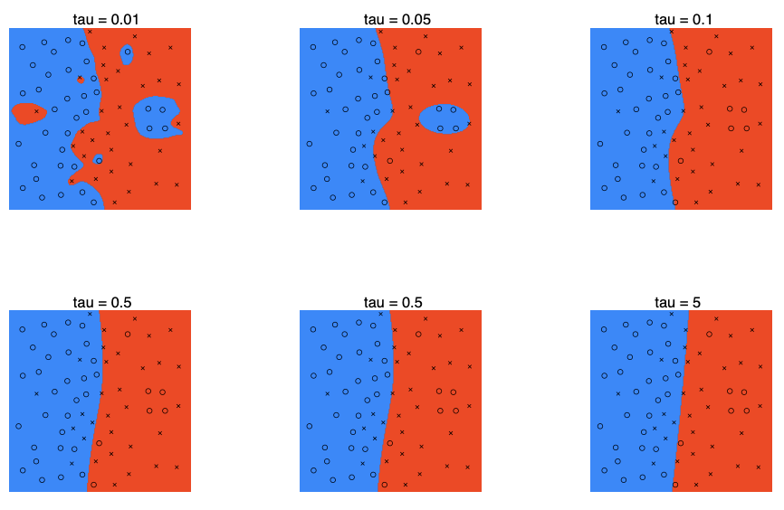

# Problem Set #1 Solutions: Supervised Learning

## 1. **Newton’s method for computing least squares**

   In this problem, we will prove that if we use Newton’s method to solve the least squares optimization problem, then we only need one iteration to converge to $`\theta^*`$.

   (a) Find the Hessian of the cost function $`J(\theta) = \frac{1}{2} \sum_{i=1}^m (\theta^T x^{(i)} - y^{(i)})^2`$.

**Answer:** As shown in the notes

To find the Hessian of the cost function

```math
J(\theta) = \frac{1}{2} \sum_{i=1}^m (\theta^T x^{(i)} - y^{(i)})^2,
```
we first compute the gradient with respect to $\theta$.

**Step 1: Compute the gradient**

The $j$-th component of the gradient is:

```math
\frac{\partial J(\theta)}{\partial \theta_j} = \frac{1}{2} \sum_{i=1}^m \frac{\partial}{\partial \theta_j} (\theta^T x^{(i)} - y^{(i)})^2
```

Using the chain rule:

```math
= \sum_{i=1}^m (\theta^T x^{(i)} - y^{(i)}) \frac{\partial}{\partial \theta_j}(\theta^T x^{(i)} - y^{(i)})
```

But $\frac{\partial}{\partial \theta_j}(\theta^T x^{(i)}) = x_j^{(i)}$ and $\frac{\partial}{\partial \theta_j} y^{(i)} = 0$, so:

```math
= \sum_{i=1}^m (\theta^T x^{(i)} - y^{(i)}) x_j^{(i)}
```

**Step 2: Compute the Hessian**

The $`(j, k)`$-th entry of the Hessian is:

```math
\frac{\partial^2 J(\theta)}{\partial \theta_j \partial \theta_k} = \sum_{i=1}^m \frac{\partial}{\partial \theta_k} \left[(\theta^T x^{(i)} - y^{(i)}) x_j^{(i)}\right]
```

Since $x_j^{(i)}$ does not depend on $\theta_k$:

```math
= \sum_{i=1}^m x_j^{(i)} \frac{\partial}{\partial \theta_k}(\theta^T x^{(i)} - y^{(i)})
```

Again, $\frac{\partial}{\partial \theta_k}(\theta^T x^{(i)}) = x_k^{(i)}$ and $\frac{\partial}{\partial \theta_k} y^{(i)} = 0$:

```math
= \sum_{i=1}^m x_j^{(i)} x_k^{(i)}
```

This is the $(j, k)$ entry of the matrix $X^T X$, where $X$ is the $m \times n$ data matrix whose $i$-th row is $(x^{(i)})^T$.

Therefore, the Hessian of $J(\theta)$ is $H = X^T X$. This can also be derived by simply applying rules from the notes on Linear Algebra.

   (b) Show that the first iteration of Newton’s method gives us 
```math
\theta^* = (X^T X)^{-1} X^T \vec{y}
```
   , the solution to our least squares problem.

**Answer:** Given any $\theta^{(0)}$, Newton’s method finds $\theta^{(1)}$ according to

Recall that Newton's method for minimizing a twice-differentiable function $J(\theta)$ is:

```math
\theta^{(1)} = \theta^{(0)} - H^{-1} \nabla_\theta J(\theta^{(0)})
```
where $H$ is the Hessian matrix of $J(\theta)$ evaluated at $\theta^{(0)}$.

For the least squares cost function,
```math
J(\theta) = \frac{1}{2} \sum_{i=1}^m (\theta^T x^{(i)} - y^{(i)})^2,
```
we have already shown that the gradient is
```math
\nabla_\theta J(\theta) = X^T X \theta - X^T \vec{y}
```
and the Hessian is
```math
H = X^T X
```

Plugging these into the Newton update:
```math
\theta^{(1)} = \theta^{(0)} - (X^T X)^{-1} (X^T X \theta^{(0)} - X^T \vec{y})
```
Expanding the terms:
```math
= \theta^{(0)} - (X^T X)^{-1} X^T X \theta^{(0)} + (X^T X)^{-1} X^T \vec{y}
= \theta^{(0)} - \theta^{(0)} + (X^T X)^{-1} X^T \vec{y}
= (X^T X)^{-1} X^T \vec{y}
```

Therefore, regardless of the initial value $\theta^{(0)}$, Newton's method jumps directly to the unique minimizer $\theta^*$ in a single iteration. This is because the least squares cost function is quadratic in $\theta$, so its gradient is linear and its Hessian is constant, making Newton's method exact in one step.

## 2. **Locally-weighted logistic regression**

   In this problem you will implement a locally-weighted version of logistic regression, where we weight different training examples differently according to the query point. The locally-weighted logistic regression problem is to maximize

```math
\ell(\theta) = -\frac{\lambda}{2} \theta^T \theta + \sum_{i=1}^m w^{(i)} \left[ y^{(i)} \log h_\theta(x^{(i)}) + (1 - y^{(i)}) \log(1 - h_\theta(x^{(i)})) \right].
```

   The $`-\frac{\lambda}{2} \theta^T \theta`$ here is what is known as a regularization parameter, which will be discussed in a future section, but which we include here because it is needed for Newton’s method to perform well on this task. For the entirety of this problem you can use the value $`\lambda = 0.0001`$.

   Using this definition, the gradient of $`\ell(\theta)`$ is given by

```math
\nabla_\theta \ell(\theta) = X^T z - \lambda \theta
```

   where $`z \in \mathbb{R}^m`$ is defined by

```math
z_i = w^{(i)} (y^{(i)} - h_\theta(x^{(i)}))
```

   and the Hessian is given by

```math
H = X^T D X - \lambda I
```

   where $`D \in \mathbb{R}^{m \times m}`$ is a diagonal matrix with

```math
D_{ii} = -w^{(i)} h_\theta(x^{(i)})(1 - h_\theta(x^{(i)}))
```

   For the sake of this problem you can just use the above formulas, but you should try to derive these results for yourself as well.

   Given a query point $`x`$, we choose compute the weights

```math
w^{(i)} = \exp \left( - \frac{\|x - x^{(i)}\|^2}{2\tau^2} \right).
```

Much like the locally weighted linear regression that was discussed in one of our sections, this weighting scheme gives more when the “nearby” points when predicting the class of a new example.

(a) Implement the Newton-Raphson algorithm for optimizing $`\ell(\theta)`$ for a new query point $`x`$, and use this to predict the class of $`x`$.

The q2/ directory contains data and code for this problem. You should implement the function

```python
y = lwlr(X_train, y_train, x, tau)
```

in the `lwlr.py` file. This function takes as input the training set (the `X_train` and `y_train` matrices), a new query point `x`, and the weight bandwidth `tau`. Given this input, the function should 1) compute weights $`w^{(i)}`$ for each training example, using the formula above, 2) maximize $`\ell(\theta)`$ using Newton’s method (or a suitable optimizer), and finally 3) output $`y = 1\{h_\theta(x) > 0.5\}`$ as the prediction.

We provide two additional functions that might help. The function

```python
X_train, y_train = load_data()
```

in `load_data.py` will load the matrices from files in the `data/` folder. The function

```python
plot_lwlr(X_train, y_train, tau, resolution)
```

in `plot_lwlr.py` will plot the resulting classifier (assuming you have properly implemented `lwlr.py`). This function evaluates the locally weighted logistic regression classifier over a large grid of points and plots the resulting prediction as blue (predicting y = 0) or red (predicting y = 1). Depending on how fast your `lwlr` function is, creating the plot might take some time, so we recommend debugging your code with `resolution = 50`; and later increase it to at least 200 to get a better idea of the decision boundary.

**Answer:** Our implementation of lwlr.py and lwlr.m:

**Python implementation:**

```python
import numpy as np
from scipy.special import expit as sigmoid

def lwlr(X_train, y_train, x, tau):
    m, n = X_train.shape
    theta = np.zeros(n)
    # compute weights
    w = np.exp(-np.sum((X_train - x) ** 2, axis=1) / (2 * tau))
    reg_lambda = 1e-4
    g = np.ones(n)
    while np.linalg.norm(g) > 1e-6:
        h = sigmoid(X_train @ theta)
        g = X_train.T @ (w * (y_train - h)) - reg_lambda * theta
        D = w * h * (1 - h)
        H = -X_train.T @ (D[:, None] * X_train) - reg_lambda * np.eye(n)
        theta = theta - np.linalg.solve(H, g)
    y_pred = sigmoid(x @ theta)
    return float(y_pred > 0.5)
```

**Matlab implementation:**
```matlab
function y = lwlr(X_train, y_train, x, tau)

m = size(X_train,1);
n = size(X_train,2);
theta = zeros(n,1);

% compute weights
w = exp(-sum((X_train - repmat(x', m, 1)).^2, 2) / (2*tau));

% perform Newton’s method
g = ones(n,1);
while (norm(g) > 1e-6)
  h = 1 ./ (1 + exp(-X_train * theta));
  g = X_train' * (w.*(y_train - h)) - 1e-4*theta;
  H = -X_train' * diag(w.*h.*(1-h)) * X_train - 1e-4*eye(n);
  theta = theta - H \ g;
end

% return predicted y
y = double(x'*theta > 0);
```

(b) Evaluate the system with a variety of different bandwidth parameters $`\tau`$. In particular, try $`\tau = 0.01, 0.05, 0.1, 0.51, 0.5, 5.0`$. How does the classification boundary change when varying this parameter? Can you predict what the decision boundary of ordinary (unweighted) logistic regression would look like?

**Answer:** These are the resulting decision boundaries, for the different values of $\tau$.



For smaller $\tau$, the classifier appears to overfit the data set, obtaining zero training error, but outputting a sporadic looking decision boundary. As $\tau$ grows, the resulting decision boundary becomes smoother, eventually converging (in the limit as $\tau \to \infty$ to the unweighted linear regression solution).

**Detailed Explanation:**

The parameter $\tau$ in locally weighted logistic regression controls the width of the weighting kernel, which determines how much influence each training point has on the prediction for a given query point $x$.

- **Small $\tau$ (narrow kernel):**
  - The weights $w^{(i)} = \exp\left(-\frac{\|x - x^{(i)}\|^2}{2\tau^2}\right)$ decay very quickly with distance.
  - Only training points very close to the query point $x$ have significant weight; distant points have negligible influence.
  - As a result, the classifier can fit the training data very closely, potentially achieving zero training error.
  - However, this can lead to a highly irregular, "noisy" decision boundary that overfits the training data and does not generalize well to new points.

- **Large $\tau$ (wide kernel):**
  - The weights decay slowly, so many or all training points contribute significantly to the prediction at $x$.
  - The influence of any single point is reduced, and the classifier becomes less sensitive to local variations in the data.
  - The decision boundary becomes smoother and less complex, reducing the risk of overfitting.
  - In the limit as $\tau \to \infty$, all weights become equal ($w^{(i)} \approx 1$ for all $i$), and the method reduces to standard (unweighted) logistic regression, where the decision boundary is determined by the global structure of the data.

**Summary:**
- Small $\tau$ $\rightarrow$ overfitting, complex and irregular decision boundary.
- Large $\tau$ $\rightarrow$ underfitting, smooth and simple decision boundary, converging to the unweighted logistic regression solution.

This behavior illustrates the classic bias-variance tradeoff: small $\tau$ yields low bias but high variance, while large $\tau$ yields higher bias but lower variance.

## 3. **Multivariate least squares**

So far, we have only considered cases where our target variable $`y`$ is a scalar value. Suppose that instead of trying to predict a single output, we have a training set with multiple outputs for each example:

```math
\{(x^{(i)}, y^{(i)}),\ i = 1, \ldots, m\},\ x^{(i)} \in \mathbb{R}^n,\ y^{(i)} \in \mathbb{R}^p.
```

Thus for each training example, $`y^{(i)}`$ is vector-valued, with $`p`$ entries. We wish to use a linear model to predict the outputs, as in least squares, by specifying the parameter matrix $`\Theta`$ in

```math
y = \Theta^T x,
```

where $`\Theta \in \mathbb{R}^{n \times p}`$.

(a) The cost function for this case is

```math
J(\Theta) = \frac{1}{2} \sum_{i=1}^m \sum_{j=1}^p \left( (\Theta^T x^{(i)})_j - y_j^{(i)} \right)^2.
```

Write $`J(\Theta)`$ in matrix-vector notation (i.e., without using any summations). [Hint: Start with the $`m \times n`$ design matrix

```math
X = \begin{bmatrix}
  --- & (x^{(1)})^T & --- \\
  --- & (x^{(2)})^T & --- \\
  & \vdots & \\
  --- & (x^{(m)})^T & ---
\end{bmatrix}
```

and the $`m \times p`$ target matrix

```math
Y = \begin{bmatrix}
  --- & (y^{(1)})^T & --- \\
  --- & (y^{(2)})^T & --- \\
  & \vdots & \\
  --- & (y^{(m)})^T & ---
\end{bmatrix}
```

and then work out how to express $`J(\Theta)`$ in terms of these matrices.]

**Answer:** The objective function can be expressed as

```math
J(\Theta) = \frac{1}{2} \operatorname{tr} \left( (X\Theta - Y)^T (X\Theta - Y) \right).
```

To see this, note that

```math
\begin{align*}
J(\Theta) &= \frac{1}{2} \operatorname{tr} \left( (X\Theta - Y)^T (X\Theta - Y) \right) \\
&= \frac{1}{2} \sum_i (X\Theta - Y)^T (X\Theta - Y)_{ii} \\
&= \frac{1}{2} \sum_i \sum_j (X\Theta - Y)_{ij}^2 \\
&= \frac{1}{2} \sum_{i=1}^m \sum_{j=1}^p \left( (\Theta^T x^{(i)})_j - y_j^{(i)} \right)^2
\end{align*}
```

(b) Find the closed form solution for $`\Theta`$ which minimizes $`J(\Theta)`$. This is the equivalent to the normal equations for the multivariate case.

(c) Suppose instead of considering the multivariate vectors $`y^{(i)}`$ all at once, we instead compute each variable $`y_j^{(i)}`$ separately for each $`j = 1, \ldots, p`$. In this case, we have a $`p`$ individual linear models, of the form

```math
y_j^{(i)} = \theta_j^T x^{(i)}, \quad j = 1, \ldots, p.
```

(So here, each $`\theta_j \in \mathbb{R}^n`$). How do the parameters from these $`p`$ independent least squares problems compare to the multivariate solution?

## 4. **Naive Bayes**

In this problem, we look at maximum likelihood parameter estimation using the naive Bayes assumption. Here, the input features $`x_j,\ j = 1, \ldots, n`$ to our model are discrete, binary-valued variables, so $`x_j \in \{0, 1\}`$. We call $`x = [x_1\ x_2\ \cdots\ x_n]^T`$ to be the input vector. For each training example, our output targets are a single binary-value $`y \in \{0, 1\}`$. Our model is then parameterized by $`\phi_{j|y=0} = p(x_j = 1|y = 0)`$, $`\phi_{j|y=1} = p(x_j = 1|y = 1)`$, and $`\phi_y = p(y = 1)`$. We model the joint distribution of $`(x, y)`$ according to

```math
p(y) = (\phi_y)^y (1 - \phi_y)^{1-y}
```

```math
p(x|y=0) = \prod_{j=1}^n p(x_j|y=0)
          = \prod_{j=1}^n (\phi_{j|y=0})^{x_j} (1 - \phi_{j|y=0})^{1-x_j}
```

```math
p(x|y=1) = \prod_{j=1}^n p(x_j|y=1)
          = \prod_{j=1}^n (\phi_{j|y=1})^{x_j} (1 - \phi_{j|y=1})^{1-x_j}
```

(a) Find the joint likelihood function $`\ell(\varphi) = \log \prod_{i=1}^m p(x^{(i)}, y^{(i)}; \varphi)`$ in terms of the model parameters given above. Here, $`\varphi`$ represents the entire set of parameters $`\{\phi_y,\ \phi_{j|y=0},\ \phi_{j|y=1},\ j = 1, \ldots, n\}`$.

(b) Show that the parameters which maximize the likelihood function are the same as

```math
\phi_{j|y=0} = \frac{\sum_{i=1}^m 1\{x_j^{(i)} = 1 \wedge y^{(i)} = 0\}}{\sum_{i=1}^m 1\{y^{(i)} = 0\}}
```

```math
\phi_{j|y=1} = \frac{\sum_{i=1}^m 1\{x_j^{(i)} = 1 \wedge y^{(i)} = 1\}}{\sum_{i=1}^m 1\{y^{(i)} = 1\}}
```

```math
\phi_y = \frac{\sum_{i=1}^m 1\{y^{(i)} = 1\}}{m}.
```

(c) Consider making a prediction on some new data point $`x`$ using the most likely class estimate generated by the naive Bayes algorithm. Show that the hypothesis returned by naive Bayes is a linear classifier—i.e., if $`p(y = 0|x)`$ and $`p(y = 1|x)`$ are the class probabilities returned by naive Bayes, show that there exists some $`\theta \in \mathbb{R}^{n+1}`$ such that

```math
p(y = 1|x) \geq p(y = 0|x) \text{ if and only if } \theta^T \begin{bmatrix} 1 \\ x \end{bmatrix} \geq 0.
```

(Assume $`\theta_0`$ is an intercept term.)

## 5. **Exponential family and the geometric distribution**

(a) Consider the geometric distribution parameterized by $`\phi`$:

```math
p(y; \phi) = (1 - \phi)^{y-1} \phi,\ \ y = 1, 2, 3, \ldots.
```

Show that the geometric distribution is in the exponential family, and give $`b(y)`$, $`\eta`$, $`T(y)`$, and $`a(\eta)`$.

(b) Consider performing regression using a GLM model with a geometric response variable. What is the canonical response function for the family? You may use the fact that the mean of a geometric distribution is given by $`1/\phi`$.

(c) For a training set $`\{(x^{(i)}, y^{(i)});\ i = 1, \ldots, m\}`$, let the log-likelihood of an example be $`\log p(y^{(i)}|x^{(i)}; \theta)`$. By taking the derivative of the log-likelihood with respect to $`\theta_j`$, derive the stochastic gradient ascent rule for learning using a GLM model with geometric responses $`y`$ and the canonical response function.
