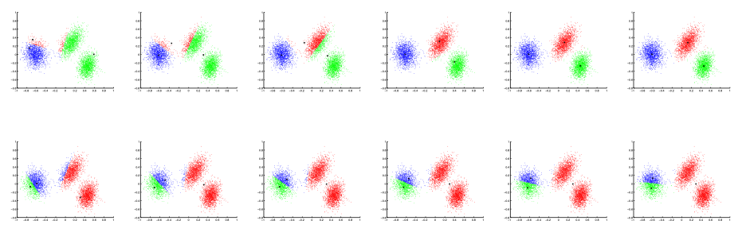

# Problem Set #3 Solutions: Learning Theory and Unsupervised Learning


## 1. **Uniform convergence and Model Selection**

In this problem, we will prove a bound on the error of a simple model selection procedure.

Let there be a binary classification problem with labels $`y \in \{0, 1\}`$, and let $`\mathcal{H}_1 \subseteq \mathcal{H}_2 \subseteq \cdots \subseteq \mathcal{H}_k`$ be $`k`$ different finite hypothesis classes ($`|\mathcal{H}_i| < \infty`$). Given a dataset $`S`$ of $`m`$ iid training examples, we will divide it into a training set $`S_{\text{train}}`$ consisting of the first $`(1-\beta)m`$ examples, and a hold-out cross validation set $`S_{\text{cv}}`$ consisting of the remaining $`\beta m`$ examples. Here, $`\beta \in (0, 1)`$.

Let $`\hat{h}_i = \arg\min_{h \in \mathcal{H}_i} \hat{\varepsilon}_{S_{\text{train}}}(h)`$ be the hypothesis in $`\mathcal{H}_i`$ with the lowest training error (on $`S_{\text{train}}`$). Thus, $`\hat{h}_i`$ would be the hypothesis returned by training (with empirical risk minimization) using hypothesis class $`\mathcal{H}_i`$ and dataset $`S_{\text{train}}`$. Also let $`h_i^* = \arg\min_{h \in \mathcal{H}_i} \varepsilon(h)`$ be the hypothesis in $`\mathcal{H}_i`$ with the lowest generalization error.

Suppose that our algorithm first finds all the $`\hat{h}_i`$'s using empirical risk minimization then uses the hold-out cross validation set to select a hypothesis from this the $`\{\hat{h}_1, \ldots, \hat{h}_k\}`$ with minimum training error. That is, the algorithm will output

```math
\hat{h} = \arg\min_{h \in \{\hat{h}_1, \ldots, \hat{h}_k\}} \hat{\varepsilon}_{S_{\text{cv}}}(h).
```

For this question you will prove the following bound. Let any $`\delta > 0`$ be fixed. Then with probability at least $`1 - \delta`$, we have that

```math
\varepsilon(\hat{h}) \leq \min_{i=1,\ldots,k} \left( \varepsilon(h_i^*) + \sqrt{\frac{2}{(1-\beta)m} \log \frac{4|\mathcal{H}_i|}{\delta}} \right) + \sqrt{\frac{2}{\beta m} \log \frac{4k}{\delta}}.
```

(a) Prove that with probability at least $`1 - \frac{\delta}{2}`$, for all $`h_i`$,

```math
|\varepsilon(\hat{h}_i) - \hat{\varepsilon}_{S_{\text{cv}}}(\hat{h}_i)| \leq \sqrt{\frac{1}{2\beta m} \log \frac{4k}{\delta}}.
```

**Answer:** For each $`\hat{h}_i`$, the empirical error on the cross-validation set, $`\hat{\varepsilon}(\hat{h}_i)`$, represents the average of $`\beta m`$ random variables with mean $`\varepsilon(\hat{h}_i)`$, so by the Hoeffding inequality for any $`\hat{h}_i`$,

```math
P(|\varepsilon(\hat{h}_i) - \hat{\varepsilon}_{S_{\text{cv}}}(\hat{h}_i)| \geq \gamma) \leq 2 \exp(-2\gamma^2 \beta m).
```

As in the class notes, to insure that this holds for all $`\hat{h}_i`$, we need to take the union over all $`k`$ of the $`\hat{h}_i`$'s.

```math
P(\exists i, \text{s.t.} |\varepsilon(\hat{h}_i) - \hat{\varepsilon}_{S_{\text{cv}}}(\hat{h}_i)| \geq \gamma) \leq 2k \exp(-2\gamma^2 \beta m).
```

Setting this term equal to $`\delta/2`$ and solving for $`\gamma`$ yields

```math
\gamma = \sqrt{\frac{1}{2\beta m} \log \frac{4k}{\delta}}
```

proving the desired bound.

(b) Use part (a) to show that with probability $`1 - \frac{\delta}{2}`$,

```math
\varepsilon(\hat{h}) \leq \min_{i=1,\ldots,k} \varepsilon(\hat{h}_i) + \sqrt{\frac{2}{\beta m} \log \frac{4k}{\delta}}.
```

**Answer:** Let $`j = \arg\min_i \varepsilon(\hat{h}_i)`$. Using part (a), with probability at least $`1 - \frac{\delta}{2}`$

```math
\begin{align*}
\varepsilon(\hat{h}) &\leq \hat{\varepsilon}_{S_{\text{cv}}}(\hat{h}) + \sqrt{\frac{1}{2\beta m} \log \frac{4k}{\delta}} \\
&= \min_i \hat{\varepsilon}_{S_{\text{cv}}}(\hat{h}_i) + \sqrt{\frac{1}{2\beta m} \log \frac{4k}{\delta}} \\
&\leq \hat{\varepsilon}_{S_{\text{cv}}}(\hat{h}_j) + \sqrt{\frac{1}{2\beta m} \log \frac{4k}{\delta}} \\
&\leq \varepsilon(\hat{h}_j) + 2\sqrt{\frac{1}{2\beta m} \log \frac{4k}{\delta}} \\
&= \min_{i=1,\ldots,k} \varepsilon(\hat{h}_i) + \sqrt{\frac{2}{\beta m} \log \frac{4k}{\delta}}
\end{align*}
```

(c) Let $`j = \arg\min_i \varepsilon(\hat{h}_i)`$. We know from class that for $`\mathcal{H}_j`$, with probability $`1 - \frac{\delta}{2}`$

```math
|\varepsilon(\hat{h}_j) - \hat{\varepsilon}_{S_{\text{train}}}(h_j^*)| \leq \sqrt{\frac{2}{(1-\beta)m} \log \frac{4|\mathcal{H}_j|}{\delta}}, \quad \forall h_j \in \mathcal{H}_j.
```

Use this to prove the final bound given at the beginning of this problem.

**Answer:** The bounds in parts (a) and (c) both hold simultaneously with probability $`(1 - \frac{\delta}{2})^2 = 1 - \delta + \frac{\delta^2}{4} > 1 - \delta`$, so with probability greater than $`1 - \delta`$,

```math
\varepsilon(\hat{h}) \leq \varepsilon(h_j^*) + 2\sqrt{\frac{1}{2(1-\gamma)m} \log \frac{2|\mathcal{H}_j|}{\delta/2}} + 2\sqrt{\frac{1}{2\gamma m} \log \frac{2k}{\delta/2}}
```

which is equivalent to the bound we want to show.

---

## 2. **VC Dimension**

Let the input domain of a learning problem be $`\mathcal{X} = \mathbb{R}`$. Give the VC dimension for each of the following classes of hypotheses. In each case, if you claim that the VC dimension is $`d`$, then you need to show that the hypothesis class can shatter $`d`$ points, and explain why there are no $`d+1`$ points it can shatter.

- $`h(x) = 1\{a < x\}`$, with parameter $`a \in \mathbb{R}`$.

**Answer:**  **VC-dimension = 1.**

(a) It can shatter point $`\{0\}`$, by choosing $`a`$ to be 2 and $`-2`$.

(b) It cannot shatter any two points $`\{x_1, x_2\}`$, $`x_1 < x_2`$, because the labelling $`x_1 = 1`$ and $`x_2 = 0`$ cannot be realized.

- $`h(x) = 1\{a < x < b\}`$, with parameters $`a, b \in \mathbb{R}`$.

**Answer:**  **VC-dimension = 2.**

(a) It can shatter points $`\{0, 2\}`$ by choosing $`(a, b)`$ to be (3, 5), (−1, 1), (1, 3), (−1, 3).

(b) It cannot shatter any three points $`\{x_1, x_2, x_3\}`$, $`x_1 < x_2 < x_3`$, because the labelling $`x_1 = x_3 = 1, x_2 = 0`$ cannot be realized.

- $`h(x) = 1\{a \sin x > 0\}`$, with parameter $`a \in \mathbb{R}`$.

**Answer:**  **VC-dimension = 1.** $`a`$ controls the *amplitude* of the sine curve.

(a) It can shatter point $`\{\frac{\pi}{2}\}`$ by choosing $`a`$ to be 1 and $`-1`$.

(b) It cannot shatter any two points $`\{x_1, x_2\}`$, since, the labellings of $`x_1`$ and $`x_2`$ will flip together. If $`x_1 = x_2 = 1`$ for some $`a`$, then we cannot achieve $`x_1 \neq x_2`$. If $`x_1 \neq x_2`$ for some $`a`$, then we cannot achieve $`x_1 = x_2 = 1`$ ($`x_1 = x_2 = 0`$ can be achieved by setting $`a = 0`$).

- $`h(x) = 1\{\sin(x + a) > 0\}`$, with parameter $`a \in \mathbb{R}`$.

**Answer:**  **VC-dimension = 2.** $`a`$ controls the *phase* of the sine curve.

(a) It can shatter points $`\{\frac{\pi}{4}, \frac{3\pi}{4}\}`$, by choosing $`a`$ to be 0, $`\frac{\pi}{2}`$, $`\pi`$, and $`\frac{3\pi}{2}`$.

(b) It cannot shatter any three points $`\{x_1, x_2, x_3\}`$. Since sine has a period of $`2\pi`$, let's define $`x_i' = x_i \mod 2\pi`$. W.l.o.g., assume $`x_1' < x_2' < x_3'`$. If the labelling of $`x_1 = x_2 = x_3 = 1`$ can be realized, then the labelling of $`x_1 = x_3 = 1, x_2 = 0`$ will not be realizable. Notice the similarity to the second question.

---

## 3. **$`\ell_1`$ regularization for least squares (Python Version)**

In the previous problem set, we looked at the least squares problem where the objective function is augmented with an additional regularization term $`\lambda\|\theta\|_2^2`$. In this problem we’ll consider a similar regularized objective but this time with a penalty on the $`\ell_1`$ norm of the parameters $`\lambda\|\theta\|_1`$, where $`\|\theta\|_1`$ is defined as $`\sum_i |\theta_i|`$. That is, we want to minimize the objective

```math
J(\theta) = \frac{1}{2} \sum_{i=1}^m (\theta^T x^{(i)} - y^{(i)})^2 + \lambda \sum_{i=1}^n |\theta_i|.
```

There has been a great deal of recent interest in $`\ell_1`$ regularization, which, as we will see, has the benefit of outputting sparse solutions (i.e., many components of the resulting $`\theta`$ are equal to zero).

The $`\ell_1`$ regularized least squares problem is more difficult than the unregularized or $`\ell_2`$ regularized case, because the $`\ell_1`$ term is not differentiable. However, there have been many efficient algorithms developed for this problem that work well in practice. One very straightforward approach, which we have already seen in class, is the coordinate descent method. In this problem you’ll derive and implement a coordinate descent algorithm for $`\ell_1`$ regularized least squares, and apply it to test data.

(a) Here we’ll derive the coordinate descent update for a given $`\theta_i`$. Given the $`X`$ and $`\vec{y}`$ matrices, as defined in the class notes, as well a parameter vector $`\theta`$, how can we adjust $`\theta_i`$ so as to minimize the optimization objective? To answer this question, we’ll rewrite the optimization objective above as

```math
J(\theta) = \frac{1}{2}\|X\vec{\theta} - \vec{y}\|_2^2 + \lambda\|\vec{\theta}\|_1 = \frac{1}{2}\|X\bar{\theta} + X_i\theta_i - \vec{y}\|_2^2 + \lambda\|\bar{\theta}\|_1 + \lambda|\theta_i|
```

where $`X_i \in \mathbb{R}^m`$ denotes the $`i`$-th column of $`X`$, and $`\bar{\theta}`$ is equal to $`\theta`$ except with $`\bar{\theta}_i = 0`$; all we have done in rewriting the above expression is to make the $`\theta_i`$ term explicit in the objective. However, this still contains the $`|\theta_i|`$ term, which is non-differentiable and therefore difficult to optimize. To get around this we make the observation that the sign of $`\theta_i`$ must either be non-negative or non-positive. But if we knew the sign of $`\theta_i`$, then $`|\theta_i|`$ becomes just a linear term. That is, we can write

```math
J(\theta) = \frac{1}{2}\|X\bar{\theta} + X_i\theta_i - \vec{y}\|_2^2 + \lambda\|\bar{\theta}\|_1 + \lambda s_i\theta_i
```

where $`s_i`$ denotes the sign of $`\theta_i`$, $`s_i \in \{-1, 1\}`$. In order to update $`\theta_i`$, we can just compute the optimal $`\theta_i`$ for both possible values of $`s_i`$ (making sure that we restrict the optimal $`\theta_i`$ to obey the sign restriction we used to solve for it), then look to see which achieves the best objective value.

For each of the possible values of $`s_i`$, compute the resulting optimal value of $`\theta_i`$. [Hint: to do this, you can fix $`s_i`$ in the above equation, then differentiate with respect to $`\theta_i`$ to find the best value. Finally, clip $`\theta_i`$ so that it lies in the allowable range — i.e., for $`s_i = 1`$, you need to clip $`\theta_i`$ such that $`\theta_i \geq 0`$.]

**Answer (for 3a, coordinate descent update for l1 regularized least squares):**

For $`s_i = 1`$,

```math
\begin{align*}
J(\theta) &= \frac{1}{2} \operatorname{tr}(X\bar{\theta} + X_i\theta_i - \vec{y})^T (X\bar{\theta} + X_i\theta_i - \vec{y}) + \lambda\|\bar{\theta}\|_1 + \lambda\theta_i \\
&= \frac{1}{2} (X_i^T X_i \theta_i^2 + 2 X_i^T (X\bar{\theta} - \vec{y}) \theta_i + \|X\bar{\theta} - \vec{y}\|_2^2) + \lambda\|\bar{\theta}\|_1 + \lambda\theta_i,
\end{align*}
```

so

```math
\frac{\partial J(\theta)}{\partial \theta_i} = X_i^T X_i \theta_i + X_i^T (X\bar{\theta} - \vec{y}) + \lambda
```

which means the optimal $`\theta_i`$ is given by

```math
\theta_i = \max\left\{ \frac{ -X_i^T (X\bar{\theta} - \vec{y}) - \lambda }{ X_i^T X_i }, 0 \right\}.
```

Similarly, for $`s_i = -1`$, the optimal $`\theta_i`$ is given by

```math
\theta_i = \min\left\{ \frac{ -X_i^T (X\bar{\theta} - \vec{y}) + \lambda }{ X_i^T X_i }, 0 \right\}.
```

(b) Implement the above coordinate descent algorithm using the updates you found in the previous part. We have provided a skeleton `def l1ls(X, y, lambda_):` function in the q3/ directory. To implement the coordinate descent algorithm, you should repeatedly iterate over all the $`\theta_i`$'s, adjusting each as you found above. You can terminate the process when $`\theta`$ changes by less than $`10^{-5}`$ after all $`n`$ of the updates.

**Answer:** See ./solution/q3_solution

(c) Test your implementation on the data provided in the q3/ directory. The `X, y, theta_true = load_data()` function will load all the data — the data was generated by $`y = X*\theta_{true} + 0.05*\text{np.random.randn}(20,1)`$, but $`\theta_{true}`$ is sparse, so that very few of the columns of $`X`$ actually contain relevant features. Run your `l1ls` implementation on this data set, ranging $`\lambda`$ from 0.001 to 10. Comment briefly on how this algorithm might be used for feature selection.

**Answer:** For $`\lambda = 1`$, our implementation of $`\ell_1`$ regularized least squares recovers the exact sparsity pattern of the true parameter that generated the data. In contrast, using any amount of $`\ell_2`$ regularization still leads to $`\theta`$'s that contain no zeros. This suggests that the $`\ell_1`$ regularization could be very useful as a feature selection algorithm: we could run $`\ell_1`$ regularized least squares to see which coefficients are non-zero, then select only these features for use with either least-squares or possibly a completely different machine learning algorithm.

---

## 4. **K-Means Clustering (Python Version)**

In this problem you’ll implement the K-means clustering algorithm on a synthetic data set. There is code and data for this problem in the q4/ directory. Use `X = np.loadtxt('X.dat')` to load the data file for clustering. Implement the `def k_means(X, k):` function in this directory. As input, this function takes the m × n data matrix X and the number of clusters k. It should output an m-element vector, clusters, which indicates which of the clusters each data point belongs to, and a k × n matrix, centers, which contains the centroids of each cluster. Run the algorithm on the data provided, with k = 3 and k = 4. Plot the cluster assignments and centroids for each iteration of the algorithm using the `draw_clusters(X, clusters, centroids)` function. For each k, be sure to run the algorithm several times using different initial centroids.

**Answer:** See ./solution/q4_solution

Below we show the centroid evolution for two typical runs with k = 3. Note that the different starting positions of the clusters lead to do different final clusterings.



## 5. **The Generalized EM algorithm**

When attempting to run the EM algorithm, it may sometimes be difficult to perform the M step exactly — recall that we often need to implement numerical optimization to perform the maximization, which can be costly. Therefore, instead of finding the global maximum of our lower bound on the log-likelihood, and alternative is to just increase this lower bound a little bit, by taking one step of gradient ascent, for example. This is commonly known as the Generalized EM (GEM) algorithm.

Put slightly more formally, recall that the M-step of the standard EM algorithm performs the maximization

```math
\theta := \arg\max_{\theta} \sum_i \sum_{z^{(i)}} Q_i(z^{(i)}) \log \frac{p(x^{(i)}, z^{(i)}; \theta)}{Q_i(z^{(i)})}.
```

The GEM algorithm, in constrast, performs the following update in the M-step:

```math
\theta := \theta + \alpha \nabla_{\theta} \sum_i \sum_{z^{(i)}} Q_i(z^{(i)}) \log \frac{p(x^{(i)}, z^{(i)}; \theta)}{Q_i(z^{(i)})}
```

where $`\alpha`$ is a learning rate which we assume is choosen small enough such that we do not decrease the objective function when taking this gradient step.

(a) Prove that the GEM algorithm described above converges. To do this, you should show that the the likelihood is monotonically improving, as it does for the EM algorithm — i.e., show that $`\ell(\theta^{(t+1)}) \geq \ell(\theta^{(t)})`$.

**Answer:** We use the same logic as for the standard EM algorithm. Specifically, just as for EM, we have for the GEM algorithm that

```math
\ell(\theta^{(t+1)}) \geq \sum_i \sum_{z^{(i)}} Q_i^{(t)}(z^{(i)}) \log \frac{p(x^{(i)}, z^{(i)}; \theta^{(t+1)})}{Q_i^{(t)}(z^{(i)})}
\geq \sum_i \sum_{z^{(i)}} Q_i^{(t)}(z^{(i)}) \log \frac{p(x^{(i)}, z^{(i)}; \theta^{(t)})}{Q_i^{(t)}(z^{(i)})}
= \ell(\theta^{(t)})
```

where as in EM the first line holds due to Jensen’s equality, and the last line holds because we choose the $`Q`$ distribution to make this hold with equality. The only difference between EM and GEM is the logic as to why the second line holds: for EM it held because $`\theta^{(t+1)}`$ was chosen to maximize this quantity, but for GEM it holds by our assumption that we take a gradient step small enough so as not to decrease the objective function.

(b) Instead of using the EM algorithm at all, suppose we just want to apply gradient ascent to maximize the log-likelihood directly. In other words, we are trying to maximize the (non-convex) function

```math
\ell(\theta) = \sum_i \log \sum_{z^{(i)}} p(x^{(i)}, z^{(i)}; \theta)
```

so we could simply use the update

```math
\theta := \theta + \alpha \nabla_{\theta} \sum_i \log \sum_{z^{(i)}} p(x^{(i)}, z^{(i)}; \theta).
```

Show that this procedure in fact gives the same update as the GEM algorithm described above.


