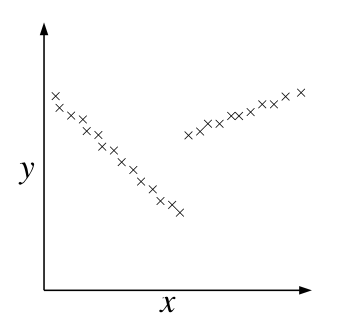

# Problem Set #4: Unsupervised Learning and Reinforcement Learning

## 1. **EM for supervised learning**

In class we applied EM to the unsupervised learning setting. In particular, we represented $`p(x)`$ by marginalizing over a latent random variable

```math
p(x) = \sum_z p(x, z) = \sum_z p(x|z)p(z).
```

However, EM can also be applied to the supervised learning setting, and in this problem we discuss a “mixture of linear regressors” model; this is an instance of what is often call the Hierarchical Mixture of Experts model. We want to represent $`p(y|x)`$, $`x \in \mathbb{R}^n`$ and $`y \in \mathbb{R}`$, and we do so by again introducing a discrete latent random variable

```math
p(y|x) = \sum_z p(y, z|x) = \sum_z p(y|x, z)p(z|x).
```

For simplicity we’ll assume that $`z`$ is binary valued, that $`p(y|x, z)`$ is a Gaussian density, and that $`p(z|x)`$ is given by a logistic regression model. More formally

```math
p(z|x; \phi) = g(\phi^T x)^z (1 - g(\phi^T x))^{1-z}
```

```math
p(y|x, z = i; \theta_i) = \frac{1}{\sqrt{2\pi}\sigma} \exp\left( -\frac{(y - \theta_i^T x)^2}{2\sigma^2} \right) \quad i = 1, 2
```

where $`\sigma`$ is a known parameter and $`\phi, \theta_0, \theta_1 \in \mathbb{R}^n`$ are parameters of the model (here we use the subscript on $`\theta`$ to denote two different parameter vectors, not to index a particular entry in these vectors).

Intuitively, the process behind model can be thought of as follows. Given a data point $`x`$, we first determine whether the data point belongs to one of two hidden classes $`z = 0`$ or $`z = 1`$, using a logistic regression model. We then determine $`y`$ as a linear function of $`x`$ (different linear functions for different values of $`z`$) plus Gaussian noise, as in the standard linear regression model. For example, the following data set could be well-represented by the model, but not by standard linear regression.



(a) Suppose $`x, y, z`$ are all observed, so that we obtain a training set $`\{(x^{(1)}, y^{(1)}, z^{(1)}), \ldots, (x^{(m)}, y^{(m)}, z^{(m)})\}`$. Write the log-likelihood of the parameters, and derive the maximum likelihood estimates for $`\phi, \theta_0, \theta_1`$. Note that because $`p(z|x)`$ is a logistic regression model, there will not exist a closed form estimate of $`\phi`$. In this case, derive the gradient and the Hessian of the likelihood with respect to $`\phi`$; in practice, these quantities can be used to numerically compute the ML estimate.

(b) Now suppose $`z`$ is a latent (unobserved) random variable. Write the log-likelihood of the parameters, and derive an EM algorithm to maximize the log-likelihood. Clearly specify the E-step and M-step (again, the M-step will require a numerical solution, so find the appropriate gradients and Hessians).

---

## 2. **Factor Analysis and PCA**

In this problem we look at the relationship between two unsupervised learning algorithms we discussed in class: Factor Analysis and Principle Component Analysis.

Consider the following joint distribution over $`(x, z)`$ where $`z \in \mathbb{R}^k`$ is a latent random variable

```math
z \sim \mathcal{N}(0, I)
x|z \sim \mathcal{N}(Uz, \sigma^2 I).
```

where $`U \in \mathbb{R}^{n \times k}`$ is a model parameters and $`\sigma^2`$ is assumed to be a known constant. This model is often called Probabilistic PCA. Note that this is nearly identical to the factor analysis model except we assume that the variance of $`x|z`$ is a known scaled identity matrix rather than the diagonal parameter matrix, $`\Phi`$, and we do not add an additional $`\mu`$ term to the mean (though this last difference is just for simplicity of presentation). However, as we will see, it turns out that as $`\sigma^2 \to 0`$, this model is equivalent to PCA.

For simplicity, you can assume for the remainder of the problem that $`k = 1`$, i.e., that $`U`$ is a column vector in $`\mathbb{R}^n`$.

(a) Use the rules for manipulating Gaussian distributions to determine the joint distribution over $`(x, z)`$ and the conditional distribution of $`z|x`$. [Hint: for later parts of this problem, it will help significantly if you simplify your solution for the conditional distribution using the identity we first mentioned in problem set #1: $`(\lambda I + BA)^{-1}B = B(\lambda I + AB)^{-1}`$.]

(b) Using these distributions, derive an EM algorithm for the model. Clearly state the E-step and the M-step of the algorithm.

(c) As $`\sigma^2 \to 0`$, show that if the EM algorithm convergences to a parameter vector $`U^*`$ (and such convergence is guaranteed by the argument presented in class), then $`U^*`$ must be an eigenvector of the sample covariance matrix $`S = \frac{1}{m} \sum_{i=1}^m x^{(i)} x^{(i)T}`$ — i.e., $`U^*`$ must satisfy

```math
\lambda U^* = SU^*.
```

[Hint: When $`\sigma^2 \to 0`$, $`\Sigma_{z|x} \to 0`$, so the E step only needs to compute the means $`\mu_{z|x}`$ and not the variances. Let $`w \in \mathbb{R}^m`$ be a vector containing all these means, $`w_i = \mu_{z^{(i)}|x^{(i)}}`$, and show that the E step and M step can be expressed as

```math
w = \frac{XU}{U^T U}, \quad U = \frac{X^T w}{w^T w}
```

respectively. Finally, show that if $`U`$ doesn’t change after this update, it must satisfy the eigenvector equation shown above.]

---

## 3. **PCA and ICA for Natural Images**

In this problem we’ll apply Principal Component Analysis and Independent Component Analysis to images patches collected from “natural” image scenes (pictures of leaves, grass, etc). This is one of the classical applications of the ICA algorithm, and sparked a great deal of interest in the algorithm; it was observed that the bases recovered by ICA closely resemble image filters present in the first layer of the visual cortex.

The q3/ directory contains the data and several useful pieces of code for this problem. The raw images are stored in the images/ subdirectory, though you will not need to work with these directly, since we provide code for loading and normalizing the images.

Calling the function [X_ica, X_pca] = load_images; will load the images, break them into 16x16 images patches, and place all these patches into the columns of the matrices X_ica and X_pca. We create two different data sets for PCA and ICA because the algorithms require slightly different methods of preprocessing the data.

For this problem you’ll implement the ica.m and pca.m functions, using the PCA and ICA algorithms described in the class notes. While the PCA implementation should be straightforward, getting a good implementation of ICA can be a bit trickier. Here is some general advice to getting a good implementation on this data set:

- Picking a good learning rate is important. In our experiments we used $`\alpha = 0.0005`$ on this data set.
- Batch gradient descent doesn’t work well for ICA (this has to do with the fact that ICA objective function is not concave), but the pure stochastic gradient described in the notes can be slow (There are about 20,000 16x16 images patches in the data set, so one pass over the data using the stochastic gradient rule described in the notes requires inverting the 256x256 $`W`$ matrix 20,000 times). Instead, a good compromise is to use a hybrid stochastic/batch gradient descent where we calculate the gradient with respect to several examples at a time (100 worked well for us), and use this to update $`W`$. Our implementation makes 10 total passes over the entire data set.
- It is a good idea to randomize the order of the examples presented to stochastic gradient descent before each pass over the data.
- Vectorize your Matlab code as much as possible. For general examples of how to do this, look at the Matlab review session.

For reference, computing the ICA $`W`$ matrix for the entire set of image patches takes about 5 minutes on a 1.6 Ghz laptop using our implementation.

After you’ve learned the $`U`$ matrix for PCA (the columns of $`U`$ should contain the principal components of the data) and the $`W`$ matrix of ICA, you can plot the basis functions using the plot-ica_bases(W); and plot-pca_bases(U); functions we have provide. Comment briefly on the difference between the two sets of basis functions.


## 4. **Convergence of Policy Iteration**

In this problem we show that the Policy Iteration algorithm, described in the lecture notes, is guarenteed to find the optimal policy for an MDP. First, define $`B^{\pi}`$ to be the Bellman operator for policy $`\pi`$, defined as follows: if $`V' = B(V)`$, then

```math
V'(s) = R(s) + \gamma \sum_{s' \in S} P_{\pi(s)}(s')(V(s')).
```

(a) Prove that if $`V_1(s) \leq V_2(s)`$ for all $`s \in S`$, then $`B(V_1)(s) \leq B(V_2)(s)`$ for all $`s \in S`$.

(b) Prove that for any $`V`$,

```math
\|B^{\pi}(V) - V^{\pi}\|_{\infty} \leq \gamma \|V - V^{\pi}\|_{\infty}
```

where $`\|V\|_{\infty} = \max_{s \in S} |V(s)|`$. Intuitively, this means that applying the Bellman operator $`B^{\pi}`$ to any value function $`V`$, brings that value function “closer” to the value function for $`\pi`$, $`V^{\pi}`$. This also means that applying $`B^{\pi}`$ repeatedly (an infinite number of times)

```math
B^{\pi}(B^{\pi}(\ldots B^{\pi}(V)\ldots))
```

will result in the value function $`V^{\pi}`$ (a little bit more is needed to make this completely formal, but we won’t worry about that here).

[Hint: Use the fact that for any $`\alpha, x \in \mathbb{R}^n`$, if $`\sum_i \alpha_i = 1`$ and $`\alpha_i \geq 0`$, then $`\sum_i \alpha_i x_i \leq \max_i x_i`$.]

(c) Now suppose that we have some policy $`\pi`$, and use Policy Iteration to choose a new policy $`\pi'`$ according to

```math
\pi'(s) = \arg\max_{a \in A} \sum_{s' \in S} P_{sa}(s')V^{\pi}(s').
```

Show that this policy will never perform worse that the previous one — i.e., show that for all $`s \in S`$, $`V^{\pi}(s) \leq V^{\pi'}(s)`$.

[Hint: First show that $`V^{\pi}(s) \leq B^{\pi'}(V^{\pi})(s)`$, then use the proceeding excercises to show that $`B^{\pi'}(V^{\pi})(s) \leq V^{\pi'}(s)`$.]

(d) Use the proceeding exercises to show that policy iteration will eventually converge (i.e., produce a policy $`\pi' = \pi`$). Furthermore, show that it must converge to the optimal policy $`\pi^*`$. For the later part, you may use the property that if some value function satisfies

```math
V(s) = R(s) + \gamma \max_{a \in A} \sum_{s' \in S} P_{sa}(s')V(s')
```

then $`V = V^*`$.

---

5. **Reinforcement Learning: The Mountain Car**

In this problem you will implement the Q-Learning reinforcement learning algorithm described in class on a standard control domain known as the Mountain Car. The Mountain Car domain simulates a car trying to drive up a hill, as shown in the figure below.

[figure: mountain car diagram]

All states except those at the top of the hill have a constant reward $`R(s) = -1`$, while the goal state at the hilltop has reward $`R(s) = 0`$; thus an optimal agent will try to get to the top of the hill as fast as possible (when the car reaches the top of the hill, the episode is over, and the car is reset to its initial position). However, when starting at the bottom of the hill, the car does not have enough power to reach the top by driving forward, so it must first accerltaterate backwards, building up enough momentum to reach the top of the hill. This strategy of moving away from the goal in order to reach the goal makes the problem difficult for many classical control algorithms.

As discussed in class, Q-learning maintains a table of Q-values, $`Q(s, a)`$, for each state and action. These Q-values are useful because, in order to select an action in state $`s`$, we only need to check to see which Q-value is greatest. That is, in state $`s`$ we take the action

```math
\arg\max_{a \in A} Q(s, a).
```

The Q-learning algorithm adjusts its estimates of the Q-values as follows. If an agent is in state $`s`$, takes action $`a`$, then ends up in state $`s'`$, Q-learning will update $`Q(s, a)`$ by

```math
Q(s, a) = (1 - \alpha)Q(s, a) + \gamma(R(s') + \gamma \max_{a' \in A} Q(s', a')).
```

At each time, your implementation of Q-learning can execute the greedy policy $`\pi(s) = \arg\max_{a \in A} Q(s, a)`$.

Implement the $`[q, steps_per_episode] = qlearning(episodes)`$ function in the q5/ directory. As input, the function takes the total number of episodes (each episode starts with the car at the bottom of the hill, and lasts until the car reaches the top), and outputs a matrix of the Q-values and a vector indicating how many steps it took before the car was able to reach the top of the hill. You should use the $`[x, s, absorb] = mountain.car(x, actions(a))`$ function to simulate one control cycle for the task — the $`x`$ variable describes the true (continuous) state of the system, whereas the $`s`$ variable describes the discrete index of the state, which you’ll use to build the Q values.

Plot a graph showing the average number of steps before the car reaches the top of the hill versus the episode number (there is quite a bit of variation in this quantity, so you will probably want to average these over a large number of episodes, as this will give you a better idea of how the number of steps before reaching the hilltop is decreasing). You can also visualize your resulting controller by calling the draw.mountain.car(q) function.

